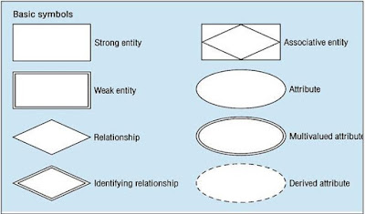

ERD merupakan gambar yang menunjukkan informasi yang dibuat, disimpan dan digunakan oleh sistem bisnis. Seorang analis yang membaca ERD digunakan untuk menemukan potongan informasi yang ada dalam suatu sistem, dan cara informasi tersebut diatur dan berkaitan satu sama lain.

<figure>Sumber: https://lksmnagung.blogspot.com/2016/08/pengertian-erd-dan-elemen-nya.html</figure>

Gambar di atas merupakan elemen elemen dasar dari sebuah ERD.
- Entity/entitas, dapat berupa orang, tempat, objek kejadian, atau konsep dalam lingkup pengguna. Strong entity berarti entitas yang berdiri sendiri, sedangkan weak entity yaitu entitas yang bergantung pada strong entity. Entitas asosiatif, merupakan entitas yang terbentuk dari suatu relasi.
- Atribut, merupakan karakteristik yang dimiliki sebuah entitas. Atribut ada yang bernilai banyak yaitu multivalued attribute dan derived attribute atau atribut turunan yang nilainya diperoleh dari nilai atribut lain.
- Relationship, yaitu relasi atau hubungan dari satu entitas ke entitas yang lain. Identifying relationship adalah hubungan yang diperlukan entitas lemah untuk dapat diidentifikasi secara unik.

Contoh implementasi ERD pada kasus aplikasi SITTA (Sistem Informasi Tiras dan Transaksi Bahan Ajar) Universitas Terbuka.

Model ini dibuat untuk menangani proses distribusi bahan ajar mulai dari pemesanan hingga pelacakan (tracking). Terdapat 5 entitas utama, yaitu:
- Entitas Mahasiswa: 
  - Menyimpan data pemesan. 
  - Atribut: NIM digunakan sebagai Primary Key untuk mengidentifikasi mahasiswa secara unik.
- Entitas Transaksi: 
  - Merepresentasikan proses pemesanan. 
  - Relasi: Entitas ini memiliki relasi 1:M dengan Mahasiswa, berarti riwayat transaksi mahasiswa tersimpan di sini.
- Entitas Bahan Ajar: 
  - Menyimpan data master buku/modul. 
  - Relasi: M:N dengan Transaksi karena satu pesanan bisa terdiri dari banyak buku, dan satu buku bisa dipesan oleh banyak orang.
- Entitas Pengiriman: 
  - Data ini terbentuk setelah transaksi dibayar. 
  - Relasi: 1:1 dengan Transaksi, menghubungkan data pembayaran (No_Billing) dengan data logistik (NO_Resi dan Kurir).
- Entitas Riwayat Perjalanan: 
  - Entitas ini berfungsi mencatat log tracking. 
  - Relasi: 1:N dengan Pengiriman, karena status paket akan terus bertambah seiring perjalanan paket dari gudang UT hingga ke alamat mahasiswa (sesuai fitur timeline pada aplikasi SITTA).

**Kesimpulan**
ERD merupakan alat penting yang digunakan untuk merancang sistem, dengan menggambarkan bagaimana data disusun, disimpan dan berhubungan dalam suatu aplikasi. Sehingga analis dapat dengan mudah mengidentifikasi informasi yang dibutuhkan sebuah sistem dan struktur relasi antar entitas.

Pada contoh kasus aplikasi SITTA Universitas Terbuka, saya menggunakan ERD untuk menggambarkan proses distribusi bahan ajar mulai dari pemesanan hingga pelacakan. Terdapat 5 entitas utama yaitu mahasiswa, transaksi, bahan ajar, poengiriman, dan riwayat perjalanan yang memiliki fungsi spesifik dan saling terhubung. Relasi antar entitas ditentukan dari alur bisnis, seperti one to many mahasiswa dan transaksi, many to many transaksi dan bahan ajar, one to many pengiriman dan riwayat perjalanan.

Maka dengan ERD ini menunjukkan bagaimana data pemesanan, pembayaran, logistik, dan tracking secara keseluruhan terintegrasi dalam satu model yang jelas agar sistem dapat beroperasi secara efisien dan mampu menangani alur distribusi bahan ajar secara terstruktur, akurat, dan mudah dipantau oleh mahasiswa sebagai pengguna utama.

Sumber referensi:
- Sufandi, U. U., Aprijani, D. A., & Pandiangan, P. (2021). Evaluasi dan hasil review desain user interface prototype aplikasi mobile SITTA Universitas Terbuka. Jurnal Nasional Pendidikan Teknik Informatika: JANAPATI, 10(3), 147-156.
- Modul MSIM4302 Modul 8 Kegiatan Belajar 1