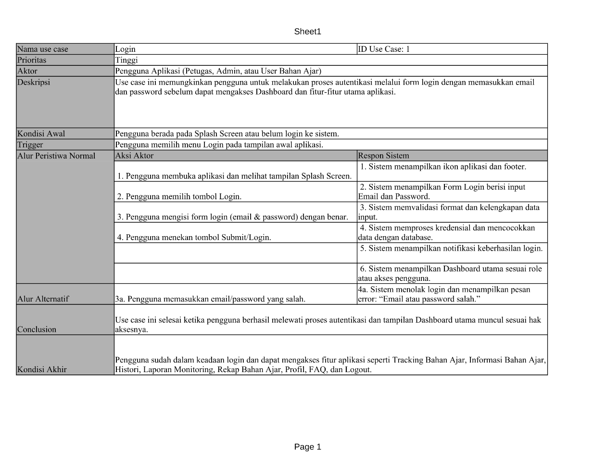
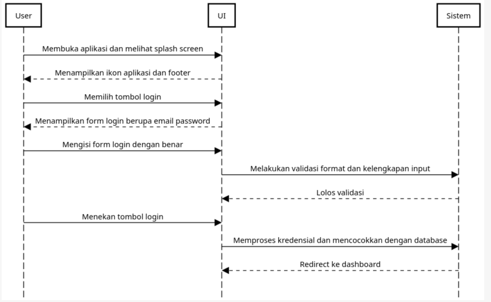

Nama: Fadhil Andriawan
NIM: 053497355
Prodi: Sistem Informasi

Berikut ini berupa deskripsi use case login dari aplikasi SITTA Universitas Terbuka.

Berikut merupakan seqeuence diagramnya.

Sumber referensi:
- BMP MSIM4302 Modul 5
- BMP MSIM4302 Modul 7
- Sufandi, U. U., Aprijani, D. A., & Pandiangan, P. (2021). Evaluasi dan hasil review desain user interface prototype aplikasi mobile SITTA Universitas Terbuka. Jurnal Nasional Pendidikan Teknik Informatika: JANAPATI, 10(3), 147-156.