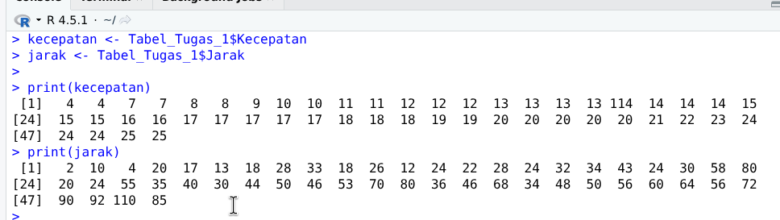
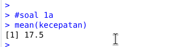
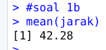
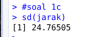
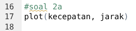
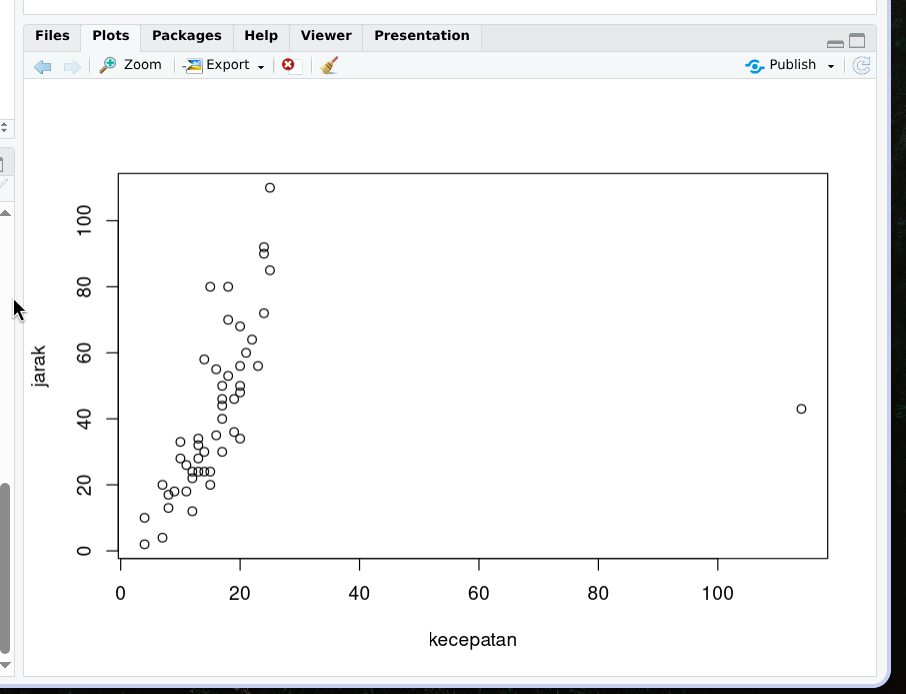
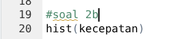
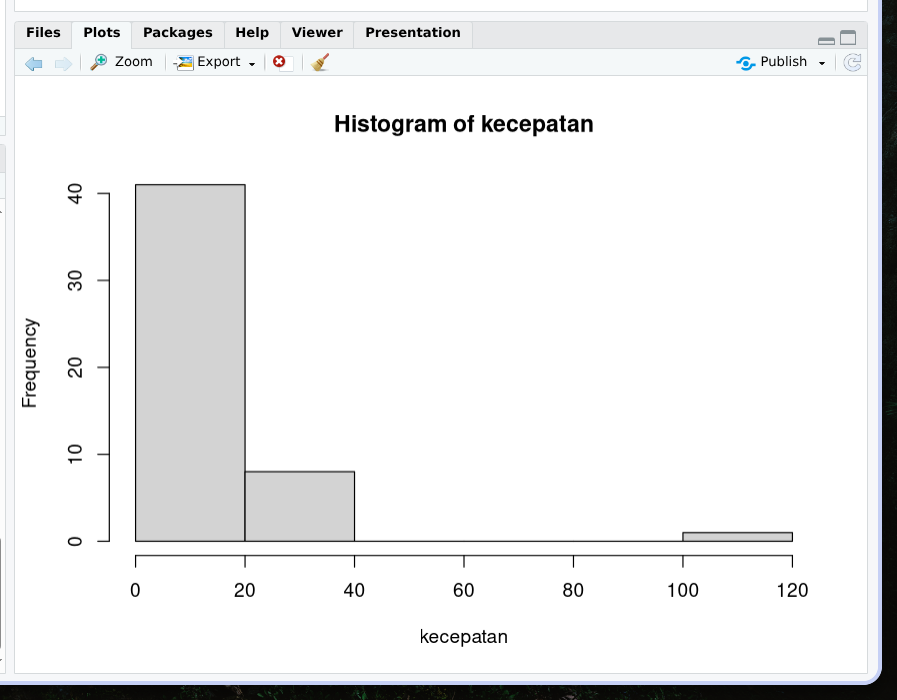

Nama: Fadhil Andriawan
NIM: 053497355
Prodi: Sistem Informasi

Selamat siang Bapak tutor, berikut untuk jawaban saya.

**Untuk data di R Studio saya melakukan import datasets dari excel yang diberikan.**



> 1. Gunakan R untuk menghitung nilai berikut
(Jawaban harus melampirkan hasil kerja di R):
a. Rata-rata kecepatan mobil (10)
b. Rata-rata jarak yang ditempuh mobil (10)
c. Standar deviasi data jarak yang ditempuh mobil (10)

1. Jawaban:
   a. 
   b. 
   c. 

> 2. Berdasarkan Tabel pada soal Nomor 1, gunakan
program R untuk membuat plot dan
interpretasikan hasilnya!
a. Scatter plot dari data kecepatan dan jarak (10)
b. Interpretasi Scatter plot yang diperoleh (15)
c. Histogram untuk data kecepatan mobil (10)
d. Interpretasi histogram yang diperoleh (15)

1. Jawaban:
   a. Hasil 
      
      
   b. Dari scatter plot menunjukkan ada hubungan positif dari kecapatan dan jarak. Sebagian besar titik membentuk pola naik dari kiri bawah ke kanan atas berarti semakin besar kecepatan semakin jauh jarak yang ditempuh. Tapi terdapat pencilan / outlier yaitu titik yang menyimpang jauh dari kelompok utama, yang bisa menunjukkan data ekstrim atau kondisi khusus. Sebagian besar titik menunjukkan pola yang cukup kompak dan korelasi yang cukup jelas antara kecepatan dan jarak.
   c. Hasil
      
      
   d. Sebagian besar data terkumpul pada rentang kecepatan rendah hingga sedang (0-40) sedangkan kecepatan tinggi di rentang 100-120 hanya ada satu atau sangat sedikit (outlier). Berarti mayoritas mobil bergerak dalam kecepatan yang ada di dalam rentang normal, hanya sedikit data yang punya kecepatan jauh di atas rata rata

> 3. Thomas memperoleh nilai 80 untuk ujian Matematika dengan rata-rata kelas 75 dan standar deviasi 10. Untuk ujian bahasa Inggris, Thomas memperoleh nilai 75 dengan rata-rata kelas 70 dan standar deviasi 8. Hitunglah koefisien keragaman untuk nilai ujian Matematika dan bahasa Inggris Thomas!

3. Jawaban: 
   Diketahui:
   - Nilai matematika: 80
   - Rata rata kelas: 75
   - Standar deviasi 10

   - Nilai bahasa Inggris: 75
   - Rata rata kelas: 70
   - Standar deviasi: 8

   Maka:
   - Koefisien keragaman matematika: $(10/75) * 100\% = 13.33\%$
   - Koefisien keragaman bahasa Inggris: $(8/70) * 100\% = 11.43\%$

Sumber referensi:
- BMP MSIM4310 Modul 1
- Aktivitas belajar 3
- https://www-geeksforgeeks-org.translate.goog/r-language/histograms-in-r-language/?_x_tr_sl=en&_x_tr_tl=id&_x_tr_hl=id&_x_tr_pto=tc

Source code:
```R
kecepatan <- Tabel_Tugas_1$Kecepatan
jarak <- Tabel_Tugas_1$Jarak

print(kecepatan)
print(jarak)

#soal 1a
mean(kecepatan)

#soal 1b
mean(jarak)

#soal 1c
sd(jarak)

#soal 2a
plot(kecepatan, jarak)

#soal 2b
hist(kecepatan)

```