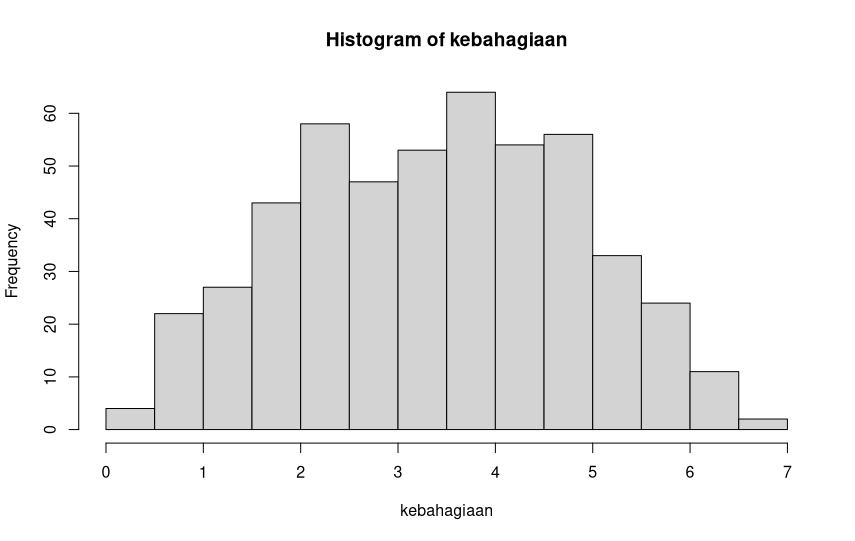
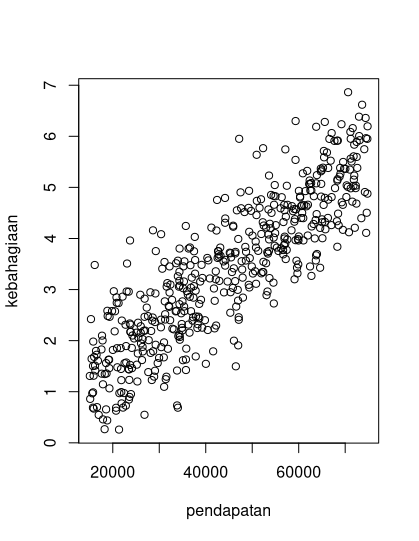
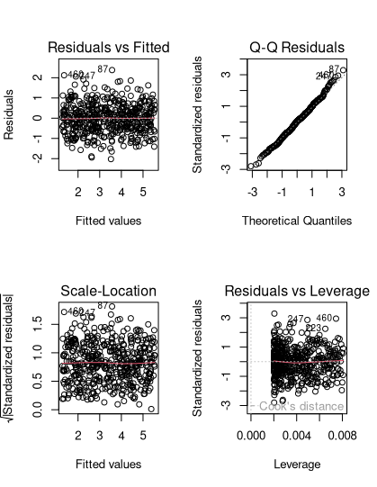
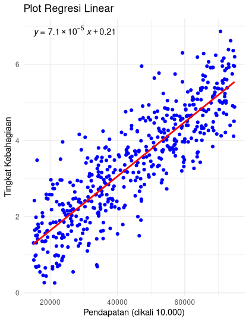

Nama: Fadhil Andriawan
NIM: 053497355
Prodi: Sistem Informasi

A. Histogram


Berdasarkan histogram tersebut, variabel terikat (kebahagiaan) terlihat memiliki bentuk yang menyerupai lonceng (bell-shaped), dengan puncak di tengah (sekitar nilai 3-4) dan menurun secara simetris ke kedua sisi.

Kesimpulan: Variabel kebahagiaan berdistribusi normal. Ini berarti asumsi normalitas untuk regresi linear terpenuhi.

<div class="break-page"></div>

B. Scatter Plot

Berdasarkan scatter plot, terlihat pola titik-titik data bergerak naik dari kiri bawah ke kanan atas membentuk jalur lurus (linear).

Kesimpulan: Terdapat hubungan linear positif antara pendapatan dan kebahagiaan. Artinya, semakin tinggi pendapatan seseorang, tingkat kebahagiaannya cenderung semakin tinggi.

C. Regresi Linear Sederhana

Y = 0.2091 + 0.00007124(X)
Dimana Y adalah Kebahagiaan dan X adalah Pendapatan.

Intercept (0.2091): Jika pendapatan bernilai 0, maka prediksi tingkat kebahagiaan adalah sebesar 0.2091

Slope (0.00007124): Setiap kenaikan pendapatan sebesar 1 satuan (mata uang), tingkat kebahagiaan diprediksi akan meningkat sebesar 0.00007124 poin.

Uji Signifikansi (Uji-t) Nilai p-value untuk variabel pendapatan adalah < 2e-16 (sangat jauh di bawah alpha 0.05).

Maka pendapatan berpengaruh secara signifikan terhadap tingkat kebahagiaan.

Koefisien Determinasi (R^2) Nilai Multiple R-squared adalah 0.7452.
Sebesar 74.52% variasi naik-turunnya tingkat kebahagiaan dapat dijelaskan oleh variabel pendapatan. Sisanya (25.48%) dijelaskan oleh faktor lain di luar model ini.
<div class="break-page"></div>



Berdasarkan plot diagnostik Residuals vs Fitted:
- Garis merah terlihat mendatar (horizontal) di sekitar angka 0.
- Titik-titik residual tersebar secara acak di atas dan di bawah garis merah tanpa membentuk pola tertentu (seperti pola corong/kipas).

Kesimpulan: Tidak terjadi gejala heteroskedastisitas. Asumsi homoskedastisitas terpenuhi, yang berarti varians dari error model adalah konstan.

```R
library(ggplot2)
library(dplyr)
library(broom)
library(ggpubr)

#poin a
pendapatan <- as.numeric(Tugas_2_data_pendapatan$pendapatan) * 10000
kebahagiaan <- as.numeric(Tugas_2_data_pendapatan$kebahagiaan)

hist(kebahagiaan)

#poin b

plot(pendapatan, kebahagiaan)

#poin c
model_regresi <- lm(kebahagiaan ~ pendapatan)
summary(model_regresi)

#poin d
par(mfrow = c(2, 2))
plot(model_regresi)

#poin e
data_plot <- data.frame(
  pendapatan = pendapatan,
  kebahagiaan = kebahagiaan
)

p <- ggplot(data_plot, aes(x = pendapatan, y = kebahagiaan)) +
  geom_point(color = "blue") + # 1. Plot data points
  geom_smooth(method = "lm", se = FALSE, color = "red") + # 2. Garis regresi linear
  stat_regline_equation( # 3. Persamaan garis linear
    aes(label = after_stat(eq.label)),
    label.x = min(data_plot$pendapatan),
    label.y = max(data_plot$kebahagiaan)
  ) +
  labs( # 4. Judul dan label sumbu
    title = "Plot Regresi Linear",
    x = "Pendapatan (dikali 10.000)",
    y = "Tingkat Kebahagiaan"
  ) +
  theme_minimal()

p

```

Sumber referensi:
- BMP MSIM4310 Modul 4
- Materi Aktivitas Belajar 9