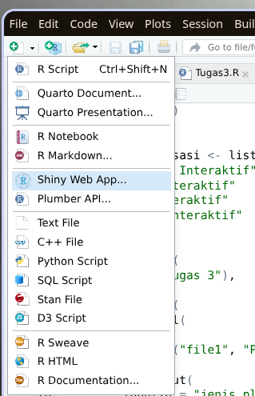
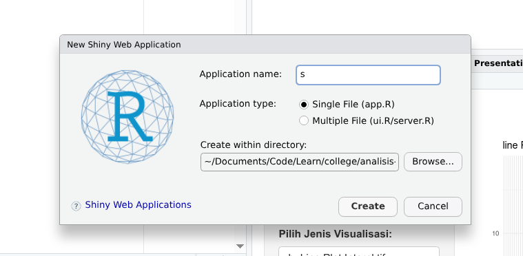

Nama: Fadhil Andriawan
NIM: 053497355
Prodi: Sistem Informasi

##### Tugas utama
> Buatlah aplikasi visualisasi data interaktif menggunakan Shiny yang memungkinkan pengguna memilih 1) variabel yang ingin divisualisasikan, dan 2) jenis plot yang ingin dilihat, yaitu a. scatter plot interaktif, b. line plot interaktif, c. bar plot interaktif, dan d. tabel data.

##### Pendahuluan
Pada tugas kali ini, saya menggunakan RStudio, Shiny, ggplot2 untuk melakukan praktikum. File berasal dari tugas tutorial 3 yang dilampirkan.

Untuk mulai membuat aplikasi Shiny, saya menggunakan fitur bawaan RStudio yaitu new project Shiny Web App.


Kemudian akan muncul popup seperti ini untuk membuat project baru.


Setelah itu saya akan mendapatkan kode default dari Shiny.

##### Pembahasan

Saya akan menjelaskan fungsi per fungsi terkait kode saya.
```R
library(ggplot2)
library(DT)
```
Baris di atas digunakan untuk melakukan import library yang digunakan, karena saya menggunakan bawaan RStudio, jadi tidak perlu mengimport Shiny.

```R
pilihan_visualisasi <- list(
  "Scatter Plot Interaktif" = "scatter",
  "Line Plot Interaktif"    = "line",
  "Bar Plot Interaktif"     = "bar",
  "Tabel Data Interaktif"   = "table"
)
```
Baris di atas digunakan untuk mendefinisikan opsi pilihan sebagaimana permintaan di tugas 3 untuk ditampilkan di UI.

```R
ui <-
...
```
Baris ui digunakan untuk menampilkan apa yang akan dilihat oleh user.

```R
server <-
...
```
Baris ini digunakan untuk menghandle logic dari UI yang ditampilkan. Seperti pengolahan data maupun menampilkan UI secara dinamis.

```R
shinyApp <-
...
```
Ini merupakan fungsi utama untuk menjalankan library Shiny.

##### Tampilan UI

```R
ui <- fluidPage(
  titlePanel("Tugas 3"),
  
  sidebarLayout(
    sidebarPanel(
      
      fileInput("file1", "Pilih file"), #input
      
      selectInput( #opsi jenis tampilan
        inputId = "jenis_plot",
        label = "Pilih Jenis Visualisasi:",
        choices = pilihan_visualisasi
      ),
      
      uiOutput("pilihan_kolom_ui"), #opsi kolom x
      uiOutput("pilihan_kolom_ui_y") #opsi kolom y
    ),
    
    mainPanel(
      uiOutput("dynamic_output")
    )
  )
)
```
Pada bagian ini, saya mendefinisikan tampilan dari aplikasi saya terbagi menjadi dua sisi, yaitu sidebar dan main panel untuk menampilkan grafiknya. 
Sidebar berisi:
- File input
- Opsi jenis visualisasi
- Opsi kolom x untuk divisualisasikan berasal dari data set yang dipilih
- Opsi kolom y untuk divisualisasikan berasal dari data set yang dipilih

Kemudian untuk main panel berisi output ui yang berasal dari kode server.

##### Server
```R
dataInput <- reactive({
  req(input$file1)
  
  df <- readxl::read_excel(path = input$file1$datapath, skip = 1)
  
  return(df)
})

```
Fungsi ini digunakan untuk membaca file input kemudian mereturn sebagai sebuah dataframe agar dapat dipakai di fungsi lainnya. 

> Penggunaan reactive berarti sebuah data atau ui akan dimuat ulang ketika data yang ada di dalamnya berubah.

```R
list_kolom_reaktif <- reactive({
  df <- dataInput()

  list_kolom <- names(df)
  return(list_kolom)
})

```

Fungsi ini digunakan untuk membaca list kolom yang ada dari file yang diinput oleh user untuk nanti digunakan kembali oleh UI sebagai opsi.

```R
jenis_plot_reactive <- reactive(input$jenis_plot)

output$dynamic_output <- renderUI({
  if (input$jenis_plot == "table") {
      DTOutput("table_output")  # Tabel
  } else {
      plotOutput("plot_data_output")  # Plot
  }
})
```

Pada baris pertama digunakan untuk memantau jenis plot yang dipilih di UI. Untuk nantinya digunakan kembali oleh fungsi lain.

Pada baris berikutnya berisi fungsi untuk mengecek, apakah yang dipilih merupakan table, jika true maka lakukan render fungsi table_output. Jika false maka render menggunakan fungsi plot_data_output.

```R
#function render table
output$table_output <- renderDT({
  df <- dataInput()
  datatable(df)
})
```
Pada table ini fungsinya hanya untuk menampilkan data dari inputan file kedalam sebuah data table menggunakan library DT atau DataTable.

##### Start Fungsi render plot
```R
#function render plot
  output$plot_data_output <- renderPlot({
```
Didefinisikan untuk melakukan render plot ke UI.

```R
df <- dataInput()
    
    req(input$kolom_dipilih)
    
    req(input$kolom_dipilih_y)

    x_var <- input$kolom_dipilih
    y_var <- input$kolom_dipilih_y
```
Baris ini digunakan untuk melakukan fungsi membaca dataInput dan validasi bahwa UI input opsi kolom x dan y serta membaca input ke dalam variable x_var dan y_var.

```R
    if (input$jenis_plot == "line") {
        if (!is.numeric(df[[x_var]])) {
        df[[x_var]] <- factor(df[[x_var]], levels = unique(df[[x_var]]))
        }
        if (!is.numeric(df[[y_var]])) {
        df[[y_var]] <- as.numeric(df[[y_var]])
        }
    }
```
Baris ini berfungsi untuk melakukan kondisi, jika jenis yang dipilih UI adalah line, maka lakukan konversi isi dari data opsi x dan y kedalam number, agar dapat tampil.

```R
    p <- ggplot(data = df, aes(x = .data[[x_var]], y = .data[[y_var]])) +
```
Baris ini berfungsi untuk membuat sebuah plot dengan library ggplot2. Parameternya berupa data untuk datanya, aes untuk menampilkan grafiknya dari sumbu x dan y.

```R
    labs(title = paste(input$jenis_plot, "Plot: ", x_var, "vs", y_var),
            x = x_var, 
            y = y_var)
```
Labs digunakan untuk menambahkan label pada tampilan ggplot secara dinamis.

```R
    if (input$jenis_plot == "scatter") {
        p <- p + geom_point() # Scatter Plot
    } else if (input$jenis_plot == "line") {
        p <- p + geom_line()  # Line Plot
    } else if (input$jenis_plot == "bar") {
      p <- p + geom_col()  # Bar Plot
    }
    
    p <- p + theme_minimal()
    
    return(p)
```
Pada baris ini digunakan kondisi per masing masing tipe, jika scatter maka gunakan geom_point, jika line maka gunakan geom_line, dan jika bar maka gunakan geom_col untuk menampilkan data.

Kemudian baris berikutnya untuk memberitahu ggplot agar menggunakan tampilan minimal, kemudian direturn fungsi tersebut yaitu p.

```R
    # untuk x
    output$pilihan_kolom_ui <- renderUI({
      kolom_names <- list_kolom_reaktif()
      
      if (length(kolom_names) > 0) {
        selectInput(
          inputId = "kolom_dipilih",
          label = "Pilih Kolom X untuk Divisualisasikan:",
          choices = kolom_names,
          selected = kolom_names[1]
        )
      }
    })
```
Pada bagian ini digunakan untuk membuat tampilan opsi list kolom x berdasarkan data yang diberikan.

```R
    # untuk y
    output$pilihan_kolom_ui_y <- renderUI({
      kolom_names <- list_kolom_reaktif()
      
      if (length(kolom_names) > 0) {
        selectInput(
          inputId = "kolom_dipilih_y",
          label = "Pilih Kolom Y untuk Divisualisasikan:",
          choices = kolom_names,
          selected = kolom_names[2]
        )
      }
    })
  }
```
Pada bagian ini digunakan untuk membuat tampilan opsi list kolom y berdasarkan data yang diberikan.

##### Kesimpulan
Pada tugas ini saya berhasil membuat sebuah aplikasi visualisasi data interaktif berbasis Shiny yang memungkinkan pengguna melakukan eksplorasi data secara fleksibel. Aplikasi mendukung empat jenis visualisasi utama, yaitu scatter plot, line plot, bar plot, dan tabel data interaktif, sesuai dengan kebutuhan tugas.

Penggunaan komponen UI dinamis seperti uiOutput() dan renderUI() memungkinkan daftar variabel X dan Y berubah menyesuaikan dengan file Excel yang diunggah pengguna. Sementara itu, sisi server memanfaatkan konsep reactive programming untuk memastikan bahwa setiap perubahan data atau input akan secara otomatis memperbarui grafik atau tabel.

Library ggplot2 digunakan sebagai mesin utama visualisasi, sementara DT digunakan untuk menampilkan tabel interaktif. Aplikasi juga dilengkapi validasi file, pemilihan kolom otomatis, serta penanganan perbedaan tipe data untuk mendukung visualisasi seperti line plot.

<div class="break-page"></div>

###### Source code:
```R
library(ggplot2)
library(DT)

pilihan_visualisasi <- list(
  "Scatter Plot Interaktif" = "scatter",
  "Line Plot Interaktif"    = "line",
  "Bar Plot Interaktif"     = "bar",
  "Tabel Data Interaktif"   = "table"
)

ui <- fluidPage(
  titlePanel("Tugas 3"),
  
  sidebarLayout(
    sidebarPanel(
      
      fileInput("file1", "Pilih file"),
      
      selectInput(
        inputId = "jenis_plot",
        label = "Pilih Jenis Visualisasi:",
        choices = pilihan_visualisasi
      ),
      
      uiOutput("pilihan_kolom_ui"),
      uiOutput("pilihan_kolom_ui_y")
    ),
    
    mainPanel(
      uiOutput("dynamic_output")
    )
  )
)

server <- function(input, output) {
  dataInput <- reactive({
    req(input$file1)
    
    df <- readxl::read_excel(path = input$file1$datapath, skip = 1)
    ext <- tools::file_ext(input$file1$datapath)
    validate(need(ext == "xlsx", "Please upload a xlsx file"))
    
    return(df)
  })
  
  list_kolom_reaktif <- reactive({
    df <- dataInput()

    list_kolom <- names(df)
    return(list_kolom)
  })
  
  jenis_plot_reactive <- reactive(input$jenis_plot)
  
  output$dynamic_output <- renderUI({
    if (input$jenis_plot == "table") {
        DTOutput("table_output")  # Tabel
    } else {
        plotOutput("plot_data_output")  # Plot
    }
  })

  #function render table
  output$table_output <- renderDT({
    df <- dataInput()
    datatable(df)
  })
  
  #function render plot
  output$plot_data_output <- renderPlot({
    df <- dataInput()
    
    req(input$kolom_dipilih)
    
    req(input$kolom_dipilih_y)
    
    x_var <- input$kolom_dipilih
    y_var <- input$kolom_dipilih_y
    
    if (input$jenis_plot == "line") {
      if (!is.numeric(df[[x_var]])) {
        df[[x_var]] <- factor(df[[x_var]], levels = unique(df[[x_var]]))
      }
      if (!is.numeric(df[[y_var]])) {
        df[[y_var]] <- as.numeric(df[[y_var]])
      }
    }
    
    p <- ggplot(data = df, aes(x = .data[[x_var]], y = .data[[y_var]])) +
        labs(title = paste(input$jenis_plot, "Plot: ", x_var, "vs", y_var),
            x = x_var, 
            y = y_var)
        
    if (input$jenis_plot == "scatter") {
        p <- p + geom_point() # Scatter Plot
    } else if (input$jenis_plot == "line") {
        p <- p + geom_line()  # Line Plot
    } else if (input$jenis_plot == "bar") {
      p <- p + geom_col()  # Bar Plot
    }
    
    p <- p + theme_minimal()
    
    return(p)
  })
  
  # untuk x
  output$pilihan_kolom_ui <- renderUI({
    kolom_names <- list_kolom_reaktif()
    
    if (length(kolom_names) > 0) {
      selectInput(
        inputId = "kolom_dipilih",
        label = "Pilih Kolom X untuk Divisualisasikan:",
        choices = kolom_names,
        selected = kolom_names[1]
      )
    }
  })
  
  # untuk y
  output$pilihan_kolom_ui_y <- renderUI({
    kolom_names <- list_kolom_reaktif()
    
    if (length(kolom_names) > 0) {
      selectInput(
        inputId = "kolom_dipilih_y",
        label = "Pilih Kolom Y untuk Divisualisasikan:",
        choices = kolom_names,
        selected = kolom_names[2]
      )
    }
  })
}

# Run the application
shinyApp(ui = ui, server = server)
```

<div class="break-page"></div>

###### Sumber referensi:
- https://shiny.posit.co/r/getstarted/shiny-basics/lesson6/
- https://shiny.posit.co/r/components/inputs/file-input/
- https://shiny.posit.co/r/components/outputs/ui/#relevant-functions
- https://shiny.posit.co/r/components/outputs/datatable/
- https://shiny.posit.co/r/components/outputs/plot-ggplot2/
- https://shiny.posit.co/r/getstarted/build-an-app/reactivity-essentials/reactive-elements.html#practice
- BMP MSIM4310 Modul 6