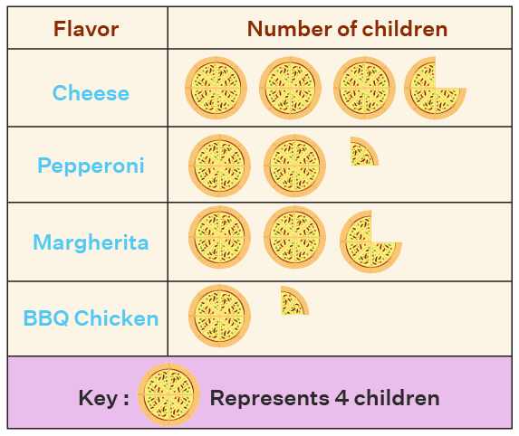
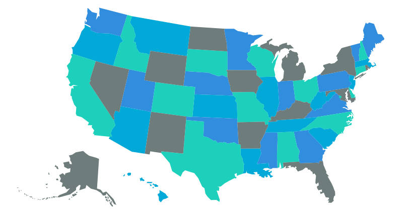
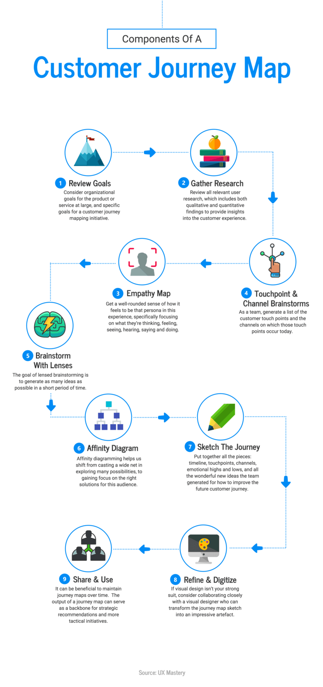

> 1. Explain types of graphs!
> 2. What are differences between Pictograph, Map Charts, and Infographic?
> 3. Why is infographic more promising and preferable in the current digital era? Elaborate your answers!

1. There are 2 types of Graph that commonly used.
   1. Line Graph
   Line Graph is having component horizontal axis (x axis), vertical axis (y axis) and gridline shaped like line column and row, mark point and line that is connecting each point.
   2. Bar Graph
   Bar graph is also having component horizontal and vertical axis, but the form is bar. Each bar having label refer to each value and category.

2. Pictograph is a diagram that comparing few data using picture or icon, while the map chart using map for giving information in geography context data. Infographic is a graph that are using a lot of image to tell information that are more complex in a simple and interesting way.
   Pictograph example:
   
   *Source: https://www-cuemath-com.translate.goog/data/pictographs/?_x_tr_sl=en&_x_tr_tl=id&_x_tr_hl=id&_x_tr_pto=imgs&_x_tr_hist=true*

   Map chart example:
   
   *Source: https://www.jaspersoft.com/articles/what-is-a-map-chart*

   Infographic:
   
   *Source: https://venngage-com.translate.goog/blog/how-to-make-an-infographic-in-5-steps/?_x_tr_sl=en&_x_tr_tl=id&_x_tr_hl=id&_x_tr_pto=imgs*

3. Infographic have many advantages:
   1. Better way to tell stories, because infographic having words and pictures, infographic can tell complex information and ability to sustain the attention  of the reader. It also can tell information for collecting relevant data, write compelling text, and present in simple, efficient, and visually pleasing.
   2. Better way to receive stories, because of data in infographic is great, it can make the reader have tangible point reference. Infographic also allowing readers to scan or skim content quickly.
   3. Better way to reach maximum coverage and attract traffic, because of infographic is simple and efficient, infographic can easily shared, being viral, and embedded in blogs and other websites. Also a rellevant and useful infographic can lead traffic into website because people can easily share it.

Source reference:
- https://piktochart.com/blog/why-use-infographics/
- BMP BING4121 Modul 8