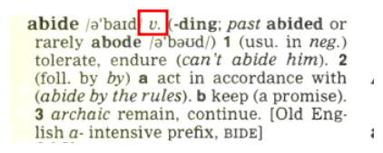

Nama: Fadhil Andriawan   NIM: 053497355   Prodi: Sistem Informasi   UPBJJ Jakarta
 

**Question Number 1**
a. What is the main ingredient of my favorite food?
    The main ingridient is 150g tempe, 1 tablespoon flour, 1 egg, 1 spoon royco, 1 cup vegetable oil for frying.

b. When we add the egg in making bregedel tempe?
    After putting the mashed tempe in a bowl and mix with the flour and Royco, add the egg.

c. How many ingredients do you need to cook “my favorite food”?
    5 ingridients, which is tempe, flour, egg, royco, vegetable oil.

**Question Number 2**
a. What happen if you using your smartphone during the exam?
    We will need to dealt with in accordance with the academic misconduct procedure and evidence being confiscated.

b. What happen if you communicate with other candidate during the examination?
    If we communicate with other candidate we will need to dealt with in
accordance with the academic misconduct procedure.

c. How much time does a coordinating invigilator give announce?
    When the exam has twenty minutes remaining, five minutes remaining, and when examination is ended.

**Question Number 3**
a. What is the part of speech of abide?
    At this part (the red rectangle).
    
    It is showing abide is a verb.

b. What is the first meaning of the word abide?
    It means tolerate, endure (can't abide him).

**Question Number 4**
a. In which two colleges is the percentage of male and female students almost the same?
    In USC and Yale.

b. Which college has the greatest disparity between the percentage of male and female students?
    In NYU.

_Source reference_:
- BMP BING4121 Modul 2, 8

