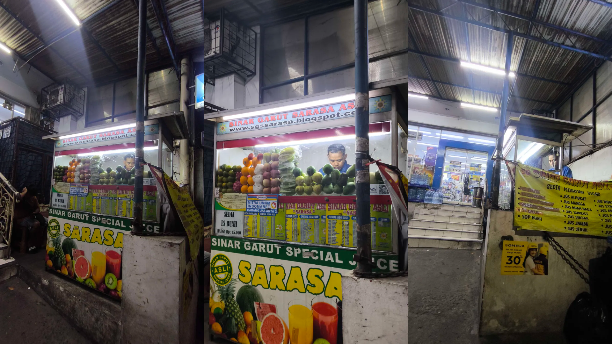

##### PERTANYAAN
> Carilah contoh praktik baik wirausahawan yang sukses mengelola bisnisnya karena berhasil menerapkan “KONSEP EFFECTUATION. Anda diminta untuk memahami effectuation dan menganalisa jenis effectuation mana saja yang diterapkan oleh seorang wirausaha dan sampai sejauh mana tingkat kepentingannya? Berikan penjelasan Anda berdasarkan materi yang telah dibahas di BMP Modul 3 dan ditambahkan dengan sumber referensi lain baik buku, liputan media cetak/digital, jurnal, dan lain-lain. Sampaikan jawaban Anda dalam ulasan 250 hingga 400 kata.

Prinsip *Effectuation* atau efektuasi adalah cara berpikir dan bertindak yang digunakan oleh seorang wirausaha ketika mengambil keputusan dalam kondisi yang penuh ketidakpastian.

Ada 5 jenis kategori dalam prinsip efektuasi ini.
1. Bird in Hand.
   Bird in hand berarti mengenali pertanyaan2 apa yang ada dalam latar belakang diri kita seperti "siapa diri saya", "apa yang bisa saya lakukan", "siapa saja yang saya kenal", "passion saya apa", "saya lulusan apa", "hobi saya apa" dan segala hal tentang diri kita.

   Pertanyaan-pertanyaan tersebut bisa menjadi awal permulaan sebagai seorang wirausahawan. Dalam prinsip ini menjelaskan tentang modal awal yang kita miliki, bisa dimulai dari hal hal kecil yang ada di diri kita.

2. Affordable Loss.
   AFfordable loss, berarti kesiapan kita sebagai wirausaha menyadari soal resiko yang ada dari bisnis kita seperti resiko finansial, resiko tenaga, resiko fungsional dan resiko psikologis. Karena dalam melakukan usahanya, entah ketika baru ingin mulai, ingin mengembangkan bisnisnya, memperluas bisnisnya akan selalu ada resiko.
   
   Sehingga kita harus menentukan berapa persen tingkat kerugian yang bisa kita toleransi ketika mengelola usaha, namun harus dipastikan nilainya tidak dengan seluruh jmodal kita. Prinsip ini bertujuan agar kita siap menghadapi kerugian sebagaimana terdapat keuntungan.

3. Lemonade.
   Lemonade berasal dari ungkapan warga Amerika "When life gives you lemon, make lemonade", artinya adalah ketika hidup kita seperti lemon yang bisa berarti asam atau tidak enak seperti kehidupan. Wirausaha harus bisa memiliki kreativitas untuk mengubah hal yang tidak menyenangkan menjadi hal yang menarik.

   Prinsip ini bertujuan agar setiap wirausaha mampu menghadapi situasi yang tidak terduga, dan memanfaatkan situasi itu menjadi sesuatu yang bermanfaat dan menjadi peluang.

4. Crazy quilt.
   Merupakan kemampuan dari sseoarang wirausaha dalam membangun relasi dengan pihak pihak lain dan menggabungkan semuanya menjadi satu usaha yang bermanfaat. Dalam contohnya, crazy quilt berarti mengajak relasi dan menjalin komitmen yang saling menguntungkan dalam bisnis. Sehingga bisa meningkatkan peluang untuk mulai bekerja dan mendapat keuntungan.

5. Pilot-in-the-plane.
   Prinsip ini menganggap hiduo kita seolah olah seperti seorang pilot yang ada di dalam pesawat dan kita yang memegang kemudinya. Dalam contohnya, seorang wirausahawan harus menentukan tujuan bisnis yang ingin dicapai.
   
   Prinsip ini mengharuskan kita sebagai seorang wirausaha untuk menentukan jalan apa yang ingin kita tempuh untuk mewujdukan semua tujuan awal.

##### PENUGASAN
> Amatilah wirausaha di sekitar lingkungan Anda. Lakukan analisis sampai sejauh mana prinsip effectuation diterapkan dalam mengelola bisnisnya. Identifikasikan pula prinsip effectuation yang paling menonjol pada wirausaha yang Anda amati tersebut.
> Susunlah dalam bentuk ulasan yang terdiri atas 1500-2000 kata. Lengkapi pembahasan Anda dengan foto wirausaha beserta lokasi usaha dan jenis produk/layanan yang ditawarkan.     

Pak Agus, Jus kelapa gading
satu kampung dengan pemilik, pak jujun
kalo ada bahan ga abis dibuang, yang cepet layu biasanya
gula disimpen di kulkas

1. Pendahuluan
   1. Latar belakang
   Fenomena wirausaha seperti Jus Sinar Garut ini menarik untuk dianalisis menggunakan prisip effectuation. Teori ini, yang dipopulerkan oleh Saras Sarasvathy, berfokus pada bagaimana wirausahawan ahli berpikir di tengah ketidakpastian. Effectuation dimulai dari sumber daya yang ada di tangan (Bird in Hand) untuk kemudian menciptakan berbagai kemungkinan tujuan. Pendekatan ini sangat relevan untuk memahami UMKM di Indonesia yang sering kali tumbuh secara organik dan adaptif.

   Jus Sinar Garut Special Kelapa Gading, sebuah usaha minuman Jus yang ada di daerah Kelapa Gading, berlokasi di depan sebuah Indomaret. Keberadaan "Paguyuban Sinar Garut Asli" menjadi salah satu hal yang membuat saya tertarik membeli jus ini, selain karena produknya yang segar dan buahnya yang manis walau tanpa gula. Organisasi ini menjadi contoh nyata dari prinsip efektuasi berbasis komunitas. Sehingga saya tertarik untuk mengamati bagaimana organisasi tersebut berperan dalam pelaku usaha.
   2. Rumusan masalah
   Apa saja prinsip efektuasi yang digunakan oleh pemilik jus?
   3. Tujuan
   Untuk menjawab penugasan dari sesi 3 tugas 1 mata kuliah Kewirausahaan di Era Digital dan mengamati proses wirausaha yang dilakukan oleh pemilik jus.

2. Profil wirausaha
   1. Sejarah singkat
   Usaha jus ini dimiliki oleh seseorang bernama Pak Jujun, saat ini Pak Jujun dibantu oleh Pak Agus dalam menjalankan usaha ini. Ketika Pak Agus sedang pulang ke kampung halaman, maka Pak Jujun akan menggantikan untuk berjualan. Keduanya sudah memiliki sertifikat dari organisasi "Paguyuban Sinar Garut Asli" yang terpampang di bagian samping dekat list menunya, sehingga siapapun yang membeli bisa mengetahui kalau pemilik jus tersebut merupakan anggota organisasi dan terjamin asli orang Garut.
   2. Produk yang ditawarkan
   Berbagai macam jus segar dijual oleh Pak Jujun dan Pak Agus. Mulai dari jus nanas, jus apel, jus belimbing atau bahkan bisa digabung seperti wortel dan tomat, serta ada juga es buah yang dijual dengan harga terjangkau.
   Saya pribadi menyukai jus mangga, jambu dan sirsak yang kental dan memiliki rasa manis dari buahnya tanpa tambahan gula apapun, saya sudah membeli di beberapa tempat lain, namun tempat ini menjadi favorit saya karena buahnya segar dan manis, serta harganya terjangkau, mulai dari 10 ribu rupiah.
   Berdasarkan pengamatan saya pada stok buah, terdapat buah yang lumayan banyak dipajang, yaitu Alpukat. Dari sini dapat disimpulkan bahwa buah yang banyak dibeli oleh para pembeli adalah alpukat. Saya sendiri pernah membeli jus tersebut, rasanya enak dan kental ditambah perpaduan susu coklat yang menjadikan rasanya semakin kaya.
   3. Target Pasar
   Pelanggan Indomaret yang berbelanja, para pekerja dan warga sekitar.
   4. Lokasi dan operasional
   Jl. Kelapa Kopyor Timur 4, Blok Bh 1 Kav. 1, RT.7/RW.9, Klp. Gading Tim., Kec. Klp. Gading, Jkt Utara, Daerah Khusus Ibukota Jakarta 14240. Buka dari pukul 7.00 pagi hingga 21.00 malam

3. Metodologi Pengamatan
   1.  Waktu dan tempat
   Selasa, 21 Oktober sekitar pukul 18.30 sore.
   2. Teknik pengumpulan informasi
      - Wawancara langsung terhadap penjual
      - Pengamatan dari pembelian hampir setiap hari selama 1 bulan lebih.

4. Analisis
   1. Prinsip Bird in Hand
   Pemilik merupakan anggota dari organisasi Paguyuban Sinar Garut Asli, yaitu organisasi sosial yang memiliki tujuan membina, serta mengelola es teler sinar garut agar tidak bisa ditiru oleh selain orang garut asli. Dari label ini, para pembeli mendapatkan jaminan kualitas dan standar yang tidak bisa ditiru oleh selain orang Garut. Pemilik maupun penjaga berasal dari daerah yang sama sehingga memiliki hubungan yang dekat sebagai partner bisnis. Ketika si penjual sedang kembali ke kampung halamannya di Garut, maka pemilik langsung yang akan menggantikan untuk menjual jus tersebut.
   Sehingga kemudahan untuk mencari orang kepercayaan seperti Pak Agus adalah bukti dari "siapa yang saya kenal", jika dibandingkan dengan resiko yang dimiliki wirausahawan lain yang merekrut orang asing.

   2. Prinsip Affordable Loss
   Dalam menjalankan usaha, penjual memiliki resiko bahwa buah-buah tersebut ada kemungkinan tidak bisa digunakan kembali seperti buah Apel karena cepat oksidasi, sehingga untuk meminimalisir resiko, penjual melakukan stok berdasarkan permintaan pelanggan yang paling banyak. Kerugian beberapa buah apel mungkin terlihat kecil, tetapi jika diakumulasikan maka itu bisa menjadi besar. Resiko seperti buah yang kurang bagus juga salah satu kerugian tersendiri yang harus dihadapi oleh pemilik. Pernah saya mendapati buah yang kurang bagus, dan langsung dibuang oleh penjual.
   Untuk buah buah yang masih bagus dan awet, bisa digunakan kembali esok hari untuk dibuat jus, beserta dengan gula yang diletakkan di kulkas sehingga lebih tahan lama. Karena pada dasarnya stok berdasarkan prinsip ini sangat penting bagi UMKM, mereka tidak bisa menggunakan modal yang besar. Ini bertolak belakang dengan minimarket yang bisa menanggung resiko stok yang lebih besar.
   Kemudian untuk modal awal seperti blender, gerobak merupakan sebuah investasi yang sudah diperhitungkan jangkauan kerugiannya.

   3. Prinsip Lemonade
   Penerapan prinsip ini dilakukan dengan cara mencampur beberapa jenis bahan seperti jus wortel dan tomat, jus mangga dan jambu dan lain-lain. Saya pernah mendapati salah satu buah sudah habis, sehingga membeli jus buah yang lain. Namun saya tidak menemukan kelemahan, justru saya merasakan buah yang dibuat sudah manis tanpa perlu tambahan dan buah nya segar.
   Ketika satu buah habis dan pembeli membeli jus lain, ini menjadi sebuah peluang kecil. Peluangnya adalah pembeli jadi mencoba varian baru dan mungkin menemukan favorit baru. Penjual juga jadi tahu buah mana yang harus distok lebih banyak.
   Penawaran jus campuran juga menjadi salah satu cara untuk mengubah keterbatasan pelanggan yang mungkin hanya ingin membeli satu jenis menjadi peluang untuk menawarkan kombinasi rasa unik dan manfaat tambahan. Hal ini bisa menjadi aset untuk mengubah buah yang ada menjadi produk baru.

   4. Prinsip Crazy Quilt
   Saya mengamati bahwa pemilik usaha berjualan di depan toko Indomaret. Sehingga antara penjual jus dan pemilik Indomaret sama-sama mendapatkan keuntungan atau istilahnya **simbiosis mutualisme**. Penjual jus mendapatkan limpahan pengunjung dari Indomaret yang pasti ramai, keamanan dan penerangan terjamin tanpa perlu bayar biaya sewa yang mahal. Bagi pemilik Indomaret keberadaan penjual jus bisa menjadi nilai tambah agar pembeli bisa sekalian jajan dan menambah kesan di depan toko, bisa juga untuk menambah peluang dari karyawan toko yang berjaga. Seringkali saya mendapati bahwa orang-orang yang baru keluar dari toko Indomaret dan hendak masuk ke Indomaret membeli jus ini. Begitupun termasuk saya, ketika menunggu jus dibuat, saya membeli beberapa keperluan di Indomaret.
   Penjual juga menyediakan pembayaran melalui QRIS, pejual tidak membuat sistem pembayarannya sendiri. Hal ini sangat menguntungkan bagi kedua belah pihak, pemilik usaha memiliki kemudahan dalam bertransaksi, dan penyedia QRIS mendapatkan pengguna dan fee transaksi. Tanpa kemitraan dengan QRIS, Pak Jujun dan Pak Agus bisa kehilangan potensi pelanggan tersebut.

   5. Prinsip Pilot-In-The-Plane
   Berdasarkan hasil pengamatan saya, penjual menyediakan banyak sekali varian jus, bahkan bisa digabung dan tidak menutup kemungkinan jika ingin beberapa varian. Penjual juga memiliki varian es buah yang semakin membuka peluang agar pembeli bisa memiliki banyak opsi untuk membeli jus.
   Penjual tidak bisa mengontrol selera pelanggan yang datang, tapi penjual bisa mengontrol variasi menu yang ditawarkan untuk bisa dibeli oleh banyak orang. Dengan opsi yang banyak, serta opsi mix maupun es buah, penjual bisa menciptakan peluangnya sendiri dan bisa menciptakan masa depan seperti pada prinsip ini.

   6. Prinsip efektuasi yang paling dominan
   Berdasarkan hasil analisis di atas, dapat disimpulkan bahwa prinsip yang paling dominan adalah Crazy Quilt dan Bird in Hand.
   Hal ini terlihat jelas dari bagaimana lokasi dari jualan ini yang sangat strategius. Ada banyak sekali pengunjung Indomaret yang keluar masuk setiap harinya. Hal ini dibuktikan dari informasi Google Maps Indomaret terkait, dimana pada setiap harinya cenderung ramai pengunjung. Ini menguntungkan kedua belah pihak, yaitu Indomaret dan penjual jus.
   Posisi jualan yang ada di pinggir jalan, menjadi sangat strategis ditambah posisinya yang berada persis di depan Indomaret. Saya pribadi, serihgkali ketika menunggu jus nya dibuat, saya masuk ke Indomaret untuk membeli beberapa kebutuhan. Begitupula dengan pelanggan-pelanggan lain, berdasarkan pengamatan saya, banyak pembeli jus yang pada awalnya pergi ke Indomaret lalu kemudian membeli jus karena posisinya yang persis di dekat pintu masuk.
   Kemudian ada juga ketersediaan QRIS, memberikan pelanggan kemudahan dalam bertransaksi dan penjual juga mendapatkan pasarnya tersendiri. Sebagaimana penelitian yang dilakukan oleh Alifia, N et al. (2024), QRIS meningkatkan volume dan nominal transaksi yang diproses oleh masing-masing merchant termasuk UMKM. Peningkatan pendapatan yang juga disebabkan oleh kemudahan penggunaan QRIS oleh semua kalangan, terutama kalangan muda yang lebih suka transaksi non-tunai. Sehingga hal ini bisa memperluas peluang bagi penjual untuk mendapatkan pelanggan, seperti mahasiswa, pekerja yang lebih sering bertransaksi non-tunai.
   Kombinasi dari usaha ini adalah modal sosial dari Paguyuban (*Bird in Hand*) yang memberikan pondasi utama dalam kepercayaan pembeli dan sumber daya yang kemudian dieksekusi dengan kemitraan strategis (*Crazy Quilt*) dengan Indomaret dan penyedia QRIS. Sehingga satu prinsip menyiapkan "strategi" dan yang lain menentukan "medan perangnya".

5. Kesimpulan dan Refleksi
   1. Kesimpulan
   Pak Jujun sebagai pemilik utama usaha Jus Sinar Garut Special dan Pak Agus sebagai penjaga usaha yang berada di lokasi strategis menawarkan jus yang segar dan harga yang terjangkau.
   Kelima prinsip dari efektuasi bisa terbukti diterapkan dalam situasi tertentu dan dalam porsi yang berbeda-beda.
   Prinsip ***Bird in Hand*** dan ***Crazy Quilt*** menjadi prinsip utama pada dalam usaha ini dimana modal sosial dari paguyuban dan kombinasi dari mitra seperti Indomaret dan QRIS menjadi kunci utama kesuksesan usaha ini.
   Model bisnis ini, menjadikan contoh nyata bagi UMKM agar bisa terus bertahan dan berkembang di tengah persaingan.
   2. Refleksi
   Melalui pengamatan ini, saya mendapat ilmu yang berharga dari Pak Jujun dan Pak Agus tentang kewirausahaan. Berjualan tidak hanya memikirkan tentang produk yang akan dijual, tapi juga analisis dari resiko yang akan dihadapi dan prinsip-prinsip yang bisa diterapkan dalam menghadapi kesulitan dan tantangan dalam usaha. Prinsip efektuasi ternyata sudah diterapkan oleh Pak Jujun dan Pak Agus, sehingga hal ini bisa menjadi ilmu ketika saya ingin melakukan wirausaha

Berikut untuk jawaban saya.
Terima kasih.

Sumber referensi:
- https://www.facebook.com/groups/427431460610067/?locale=id_ID
- https://maps.app.goo.gl/Mm1LHTRov5s6HyzM9
- Alifia, N., Permana, E., & Harnovinsah, H. (2024). Analisis penggunaan QRIS terhadap peningkatan pendapatan UMKM. Jurnal Riset Pendidikan Ekonomi, 9(1), 102-115.
- BMP MKMI4203 Kewirausahaan di era digital