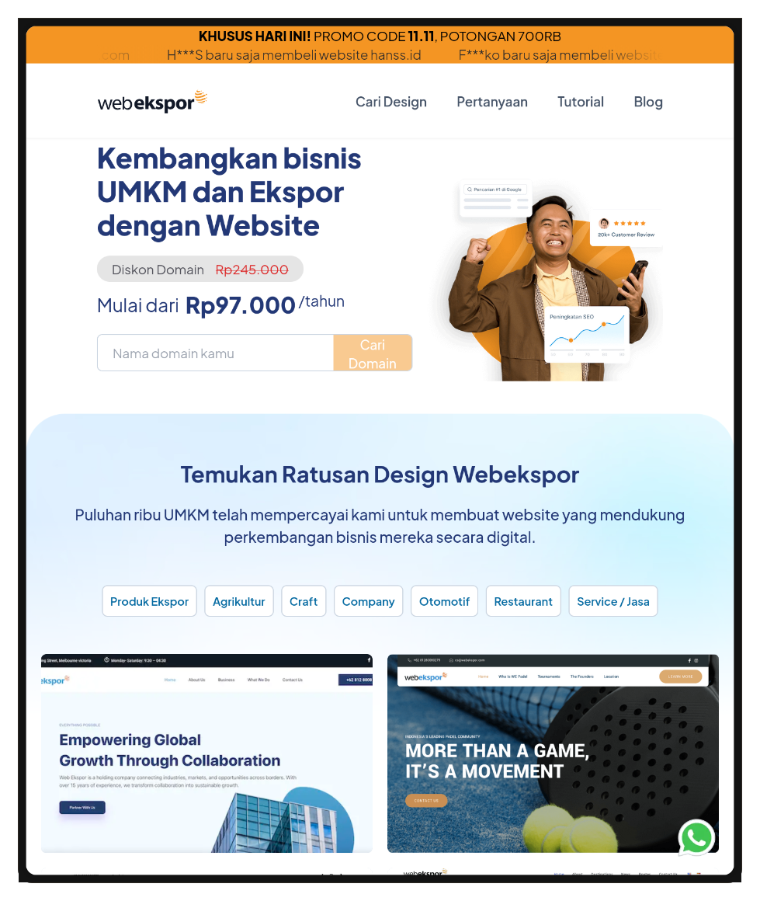
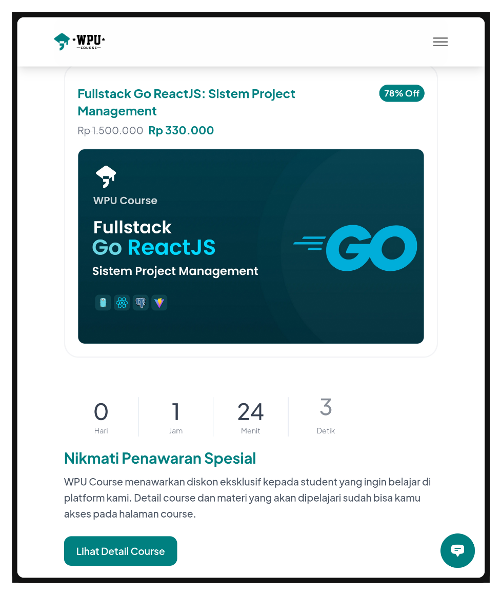
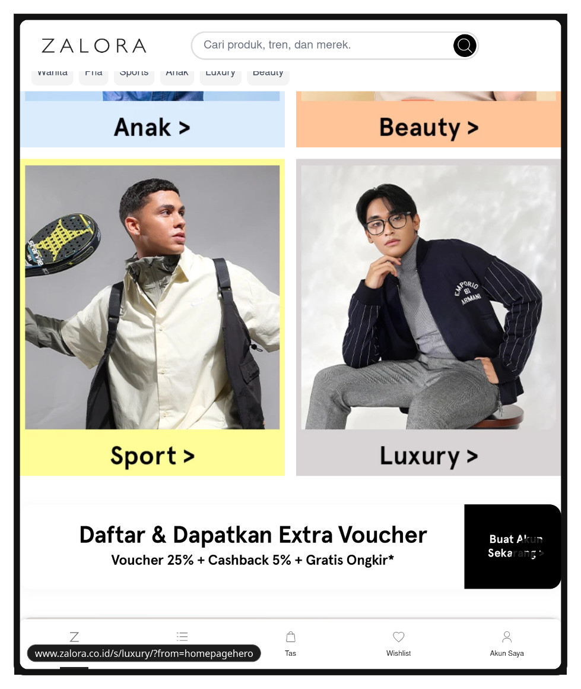
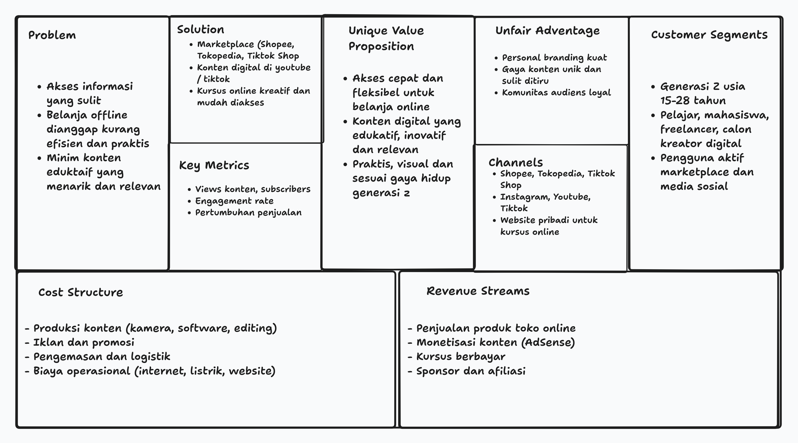

Nama: Fadhil Andriawan
NIM: 053497355
Prodi: Sistem Informasi

##### Pertanyaan
wirausahawan saat ini harus dapat memanfaatkan peluang transformasi digital untuk mempertahankan sustainability dengan mengutamakan pada keunggulan untuk menghindari persaingan ketat.
Anda diminta untuk mengulas mengenai “Wirausaha yang mengelola bisnis berskala kecil dan menengah harus dapat  memanfaatkan digital transformation agar dapat NAIK KELAS DAN MENINGKATKAN PERFORMANYA”
note: Tetapkan usaha secara spesifik, kemudian anda dapat menggunakan blue ocean strategy dan strategy update lainnya

###### Jawaban
Di dalam era transformasi digital, Usaha Kecil dan Menengah (UKM) menghadapi tantangan sekaligus peluang besar. Perubahan perilaku konsumen dalam menggunakan online platform mendorong pelaku usaha untuk mengadopsi strategi transformasi digital secara terencana. UKM yang berani melakukan inovasi bisnis, mengintegrasikan teknologi dalam operasional, serta membangun interaksi berbasis data, dapat meningkatkan daya saing dan memperkuat keberlanjutan usaha di tengah perubahan pasar.

Kopi Tuku merupakan salah satu contoh wirausaha yang berhasil melakukan transformasi digital dan menerapkan blue ocean strategy. Pada saat pasar kopi di Indonesia didominasi oleh brand premium dan model dine-in yamg eksklusif, Kopi Tuku menggunakan strategi yang berbeda. Pendiri Kopi Tuku merancang strategi dengan inovasi produk kopi susu gula aren, konsep take-away, pelayanan yang cepat, dan harga terjangkau. 

Pendekatan ini menghasilkan pengalaman konsumen yang unik dan langsung mengangkat Kopi Tuku ke segmen pasar baru yang belum tersentuh pesaing utama. Hal tersebut selaras dengan blue ocean strategy, di mana pelaku usaha menciptakan ruang pasar baru melalui keunggulan nilai yang khas, bukan bersaing secara di pasar yang sudah ramai.

Strategi pengelolaan bisnis yang berpegang pada prinsip mindful expansion bertumbuh perlahan, menjaga kualitas, dan tetap dekat dengan komunitas jelas terlihat pada perjalanan Kopi Tuku. 

Jika dianalisis menggunakan kerangka Four Actions Framework dari Kim & Mauborgne (1997), strategi Kopi Tuku dapat dijabarkan sebagai berikut.
- Hapus, faktor yang tidak memberi nilai tambah terhadap persepsi pelanggan. Kopi tuku menghilangkan elemen dekorasi mewah dan konsep dine-in yang tidak memberi nilai tambah signifikan terhadap persepsi pelanggan.
- Kurangi, faktor yang berlebihan, kopi tuku mengurangi biaya operasional dengan penggunaan ruang minimalis dan fokus pada layanan take-away.
- Tingkatkan, faktor penting dalam mengilangkan kompromi dan menciptakan value, yaitu fokus pada kualitas rasa & kecepatan layanan.
- Ciptakan, value yang belum ada di industri saat ini, yaitu kopi susu gula aren dengan cita rasa lokal, sekaligus menciptakan pengalaman konsumen yang dekat dengan budaya sekitar.

Selain inovasi dari nilai, keberhasilan Kopi Tuku juga berasal dari pemanfaatan teknologi digital dalam operasional hariannya. Kopi Tuku mengoptimalkan dan memaksimalkan plaform pemesanan online seperti GoFood dan GrabFood untuk memperluas jangkauan knosumen tanpa perlu melakukan ekspansi gerai secara besar besaran. Dengan adanya media sosial seperti Instagram juga membantu membangun kedekatan emosional dengan pelanggan melalui konten yang autentik dan berfokus pada cerita di balik produk.

Di sisi lain, penggunaan sistem pembayaran digital seperti QRIS memudahkan transaksi sekaligus mempercepat proses layanan. Integrasi teknologi ini memberikan efisiensi operasional, meningkatkan visibilitas merek, dan mendukung pengambilan keputusan berbasis data terkait jam penjualan tersibuk, preferensi menu, serta respons konsumen terhadap inovasi baru. 

Sehingga transformasi digital dapat menjadi elemen strategis yang dapat memungkinkan Kopi Tuku menjaga konsistensi pengalaman pelanggan dan memperkuat posisinya sebagai pelopor di industri kopi modern.

##### Penugasan
Berdasarkan peluang usaha tersebut, susunlah Lean Canvas yang terdiri atas 9 blok seperti penjelasan pada Modul 6. Sampaikan jawaban Anda dalam ulasan 500 hingga 600 kata yang dilengkapi dengan bagan Lean Canvas usaha yang akan didirikan.

###### Jawaban
Dalam era transformasi digital yang berkembang pesat, generasi Z tumbuh dengan karakteristik yang sangat berbeda dari generasi sebelumnya. Generasi Z menjadi generasi yang sudah terbiasa dengan perangkat mobile, akses internet tanpa batas, serta lingkungan yang serba cepat dan dinamis. Perubahan perilaku ini membuka peluang sangat besar bagi pengembangan usaha berbasis digital, khususnya toko online dan konten digital. Peluang usaha ini memanfaatkan tingginya ketergantungan generasi Z terhadap teknologi, serta preferensi mereka terhadap proses yang praktis, fleksibel, visual, dan kreatif.

Untuk melakukan validasi dan merancang usaha yang relevan dengan segmentasi pasar ini, model Lean Canvas bisa menjadi alat yang tepat karena membantu wirausaha memetakan inti bisnis secara sederhana namun strategis. Lean Canvas terdiri atas sembilan blok yang menggambarkan inti model bisnis, yaitu Problem, Customer Segment, Unique Value Proposition, Solution, Channels, Revenue Streams, Cost Structure, Key Metrics, dan Unfair Advantage.

1. Problem
Generasi Z membutuhkan akses layanan dan produk yang cepat, praktis, dan tersedia kapan saja. Mereka sering menghadapi masalah kesulitan akses informasi, ketidakpraktisan belanja offline, serta kurangnya konten pembelajaran yang kreatif dan relevan dengan perkembangan teknologi.

1. Customer Segments
Target utama adalah generasi Z berusia 15 - 28 tahun yang aktif di platform digital. Mereka memiliki karakter multitasking, ketertarikan pada visual dan audio-visual, serta menginginkan proses yang efisien. Segmen ini mencakup pelajar, mahasiswa, pekerja lepas, hingga calon kreator digital.

1. Unique Value Proposition
Usaha menawarkan pengalaman digital yang mudah diakses, cepat, kreatif, dan selaras dengan kebutuhan generasi Z. Nilai uniknya adalah akses cepat dan fleksibel untuk belanja online serta konten digital yang edukatif, inovatif, dan relevan. Kombinasi toko online dan konten digital menawarkan nilai berbeda dari pesaing umum.

1. Solution
Terdapat dua solusi inti:
- Platform toko online melalui marketplace seperti Shopee atau Tokopedia, dan pada tahap lanjut membangun website khusus seperti Zalora.
- Pembuatan konten digital/kursus online yang kreatif, edukatif, dan mudah diakses melalui platform seperti YouTube, TikTok, atau website kursus berbayar.

1. Channels
Saluran distribusi berupa marketplace (Shopee, Tokopedia), media sosial (Instagram, YouTube, TikTok), serta website pribadi. Selain itu, promosi dilakukan melalui konten digital, iklan berbayar, dan kolaborasi dengan kreator lain.

1. Revenue Streams
Pendapatan berasal dari penjualan produk melalui toko online, monetisasi konten digital (AdSense), penjualan kursus online, kerja sama sponsor, serta afiliasi.

1. Cost Structure
Biaya utama meliputi produksi konten, biaya iklan, pengembangan website, biaya pengemasan dan logistik, serta biaya peralatan seperti kamera dan perangkat editing.

1. Key Metrics
Indikatornya meliputi jumlah pengunjung toko online, conversion rate, jumlah views konten, peningkatan subscribers, engagement rate, serta pertumbuhan penjualan.

1. Unfair Advantage
Keunggulan berasal dari personal branding kuat, konsistensi konten kreatif, hubungan komunitas dengan audiens, serta perbedaan gaya dalam penyampaian konten.

Keunggulan berupa personal branding, komunitas audiens, serta gaya konten yang khas menjadi faktor pembeda yang sulit ditiru. Keunggulan ini dapat menjadi fondasi utama yang kuat ketika usaha terus berkembang di tengah persaingan digital yang dinamis.

Secara keseluruhan, Lean Canvas ini menunjukkan bahwa usaha toko online dan konten digital memiliki struktur model bisnis yang terarah dan sesuai dengan kebutuhan generasi Z. Peluang pasar yang besar, ditambah kesiapan teknologi yang mendukung, memberikan dasar yang kuat untuk mengembangkan usaha ini dalam jangka panjang.

<figure>Sumber: webekspor.com</figure>

<figure>Sumber: wpucourse.id</figure>

<figure>Sumber: zalora.co.id</figure>

##### Bagan Lean Canvas

Referensi:
- https://mum.id/news/strategi-digitalisasi-umkm-contoh-tips-maksimalkan-teknologi
- <https://www-blueoceanstrategy-com.translate.goog/blog/7-powerful-blue-ocean-strategy-examples/?_x_tr_sl=en&_x_tr_tl=id&_x_tr_hl=id&_x_tr_pto=tc>
- <https://glints.com/id/lowongan/red-ocean-strategy-adalah/>
- <https://wartaekonomi.co.id/read554081/cerita-suksesnya-eksplorasi-rasa-toko-kopi-tuku-pencetus-kopi-susu-gula-aren>
- <https://www.esb.id/id/inspirasi/strategi-kopi-tuku-omset-maksimal>
-  https://youtu.be/V_Kitz2RvJ8?si=x5DFuUfSjgvNRRVg
-  https://youtu.be/JKuFa2LVcsE?si=QDRwYuc5bnEJpanx
-  Ningsih, H. A., Sasmita, E. M., & Sari, B. (2021). Pengaruh persepsi manfaat, persepsi kemudahan penggunaan, dan persepsi risiko terhadap keputusan menggunakan uang elektronik (QRIS) pada mahasiswa. Ikraith-ekonomika, 4(1), 1-9.
- BMP MKWI4203 Modul 7 Kegiatan Belajar 1.
- BMP MKWI4203 Modul 6 Kegiatan Belajar 2.
- Lampiran Tugas 2 Kewirausahaan.