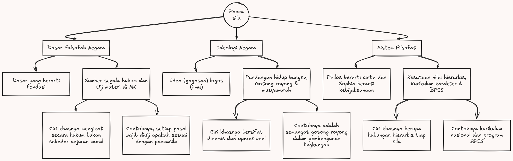

Nama: Fadhil Andriawan

NIM: 053497355

Prodi: Sistem Informasi

Judul Tugas: Tugas Tutorial 2 Pancasila

Pancasila

**Pancasila sebagai dasar falsafah negara**

Kata dasar sendiri menurut karya Dendy Sugono, dkk. tahun 2019, dasar berarti satuan baik tunggal maupun kompleks yang berfungsi sebagai fondasi dalam membentuk satuan yang lebih besar.

Sedangkan dasar negara berarti dasar yang digunakan sebagai tumpuan dan yang memberikan kekuatan berdirinya dari sebuah negara. Konsep ini dipahami sebagai nilai fundamental dari sebuah negara sebagai fondasi dan tata cara dalam melaksanakan kehidupan.

Seluruh produk hukum, termasuk UUD 1945 dan peraturan perundang-undangan di bawahnya, harus bersumber dan tidak bertentangan dengan nilai-nilai Pancasila.

Fokus utama:

Pancasila sebagai dasar falsafah negara berfokus pada fungsinya sebagai sumber dari segala sumber hukum. Ciri khasnya adalah sifatnya yang yuridis-formal, artinya Pancasila mengikat seluruh penyelenggaraan negara secara hukum, bukan sekadar anjuran moral.

Contoh penerapan:

Ketika pemerintah menyusun undang-undang, setiap pasal wajib diuji apakah sesuai dengan nilai-nilai Pancasila melalui Mahkamah Konstitusi. Sebagai contoh apabila pasal-pasal yang dinilai bertentangan dengan sila Kemanusiaan yang Adil dan Beradab dapat dibatalkan melalui uji materi. Hal ini menunjukkan bahwa Pancasila bukan hanya simbol, melainkan tolak ukur hukum yang jelas.

**Pancasila sebagai Ideologi Negara**

Ideologi berasal dari bahasa Yunani idea (gagasan) dan logos (ilmu). Sebagai ideologi negara, Pancasila berfungsi sebagai pandangan hidup bangsa Indonesia yakni seperangkat nilai yang menjadi pedoman, tujuan, dan cita-cita bersama. Berbeda dengan dasar falsafah yang lebih bersifat yuridis-formal, ideologi lebih berkaitan dengan bagaimana bangsa ini memandang dirinya dan dunia. 

Penerapannya tampak dalam budaya musyawarah mufakat dalam pengambilan keputusan, semangat gotong royong di masyarakat, serta prinsip keadilan sosial dalam kebijakan publik.

Maka dapat diartikan Pancasila sebagai ideologi berarti dasar kebijakan dalam penyelenggaraan pemerintahan negara. Pancasila sebagai filsafat negara juga disebutkan dalam Pembukaan UUD 1945 sebagai dasar negara dan merupakan cita cita hukum yang meliputi hukum dasar tertulis dan tidak tertulis.

Fokus utama: 

Pancasila sebagai ideologi negara berfokus pada pembentukan identitas, arah, dan semangat kebangsaan. Ciri khasnya adalah sifatnya yang dinamis dan operasional. Pancasila menjadi patokan dalam merespons tantangan zaman, mulai dari ancaman radikalisme hingga pengaruh globalisasi, tanpa harus meninggalkan jati diri bangsa.

Contoh penerapan: 

Semangat gotong royong tercermin dalam program-program pemberdayaan masyarakat seperti dana desa, di mana warga bersama-sama merencanakan dan mengelola pembangunan di lingkungannya. Selain itu, budaya musyawarah mufakat tampak dalam mekanisme Rapat Dengar Pendapat di DPR, serta dalam penyelesaian sengketa adat yang lebih mengutamakan mediasi daripada keputusan sepihak.

**Pancasila sebagai Sistem Filsafat**

Filsafat sendiri berasal dari istilah Yunani yaitu "philos" dan "sophia". "Philos" berarti cinta, kesukaan, dan kebahagiaan. "Sophia" berarti kebijaksanaan, sehingga filsafat berarti memiliki cinta untuk kebijaksanaan.

Pancasila disebut sebagai sistem filsafat karena kelima silanya bukan sekadar kumpulan nilai terpisah, melainkan membentuk satu kesatuan yang utuh dan hierarkis sila pertama menjadi landasan moral bagi keempat sila berikutnya. Pancasila sebagai filsafat negara juga termaktub dalam Pembukaan UUD 1945 sebagai cita-cita hukum yang meliputi hukum dasar tertulis maupun tidak tertulis.

Fokus utama: 

Pancasila sebagai sistem filsafat berfokus pada kekoherensian dan keutuhan nilai. Ciri khasnya adalah hubungan hierarkis antar sila pertama (Ketuhanan Yang Maha Esa) menjadi landasan moral dan etika bagi keempat sila berikutnya, sehingga nilai kemanusiaan, persatuan, demokrasi, dan keadilan sosial semuanya berakar pada kesadaran ketuhanan.

Contoh penerapan: 

Dalam dunia pendidikan, kurikulum nasional dirancang tidak hanya untuk mencerdaskan secara intelektual, tetapi juga untuk membentuk karakter yang berketuhanan dan berkemanusiaan - hal ini mencerminkan filosofi sila pertama dan kedua secara bersamaan. Di bidang ekonomi, prinsip keadilan sosial dari sila kelima menjadi landasan filosofis kebijakan seperti subsidi bagi masyarakat kurang mampu dan program jaminan sosial nasional (BPJS).

Ketiga sisi ini saling melengkapi dimana falsafah negara memberikan fondasi hukum, ideologi memberikan arah dan motivasi, sedangkan sistem filsafat memberikan kerangka berpikir yang koheren. 

Sumber referensi:
- https://id.wikipedia.org/wiki/Ideologi
- BMP MKWN4110 Modul 3