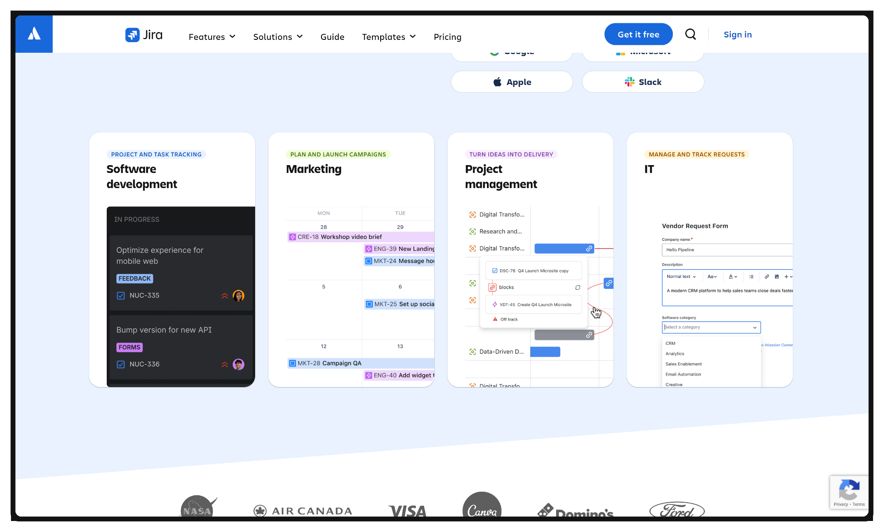

Nama: Fadhil Andriawan
NIM: 053497355
Prodi: Sistem Informasi

##### Studi kasus
Anda adalah seorang manajer proyek yang baru ditunjuk untuk memimpin tim dalam mengembangkan dan meluncurkan aplikasi seluler bernama "Eco-Travel". Aplikasi ini bertujuan untuk membantu pengguna menemukan dan memesan paket wisata ramah lingkungan di Indonesia. Proyek ini memiliki target waktu 6 bulan dan anggaran yang ketat.
Tim Anda terdiri dari pengembang perangkat lunak, desainer UI/UX, tim pemasaran, dan konsultan subkontrak yang bertugas mengumpulkan data destinasi wisata. Selama fase awal proyek, Anda menghadapi beberapa tantangan:
- Data Awal: Tim pengembang melaporkan bahwa data awal yang diberikan oleh tim internal tidak lengkap dan beberapa di antaranya tidak akurat, sehingga menghambat proses pengembangan fitur pencarian.
- Keterbatasan Anggaran: Anggaran proyek sangat ketat, dan setiap perubahan atau kesalahan yang tidak terduga dapat menyebabkan pembengkakan biaya yang signifikan.
- Ketergantungan Eksternal: Kualitas data dan kecepatan pengumpulan oleh konsultan subkontrak menjadi faktor kritis yang tidak sepenuhnya berada di bawah kendali Anda

> 1. Analisis Peran Manajer Proyek
> Sebagai manajer proyek, bagaimana Anda akan memantau dan mengendalikan kemajuan proyek ini, terutama mengingat data awal yang tidak akurat? Jelaskan langkah-langkah konkret yang akan Anda ambil untuk memastikan kebenaran data yang berasal dari tim dan konsultan.

Dalam menjadi seorang manajer proyek, memastikan kebenaran data adalah tugas awal yang dilakukan untuk melacak kemajuan secara efektif.

Dalam memantau dan mengendalikan data, akan dilakukan audit secara langsung setiap data atau informasi yang masuk berdasarkan metodologi agile. Metode agile sendiri memecah proyek besar menjadi bagian bagian kecil yang dikerjakan secara berkalah ke pengguna dengan proses iterasi atau sprint.

Setiap sprint, dilakukan review dan refleksi dari setiap data yang ada, untuk memastikan data yang digunakan valid dan sesuai kebutuhan.

Dalam melakukan audit data, saya akan melakukan pengecekan terhadap keakuratan data dan kelengkapan data menggunakan observasi langsung, wawancara dan cek data dengan sumber eksternal yang terpercaya seperti data dari pemerintah atau badan statistik.

Kemudian menyertakan tim verifikasi data internal dan eksternal untuk memeriksa setiap data yang masuk dalam daily stand up atau meeting mingguan.

>2. Aplikasi Manajemen Risiko
> Gunakan lima langkah proses manajemen risiko (Identifikasi, Analisis, Prioritasi, Penerapan Solusi, Pemantauan) untuk menganalisis dan merespons risiko-risiko yang telah diidentifikasi dalam kasus ini. Buatlah sebuah tabel yang berisi:

Berdasarkan contoh kasus aplikasi "Eco Travel", berikut merupakan identifikasi dalam proses manajemen resiko.

|Identifikasi resiko|Analisis resiko|Prioritas resiko|Respons/solusi|
|-------------------|---------------|----------------|-------------|
| Data destinasi wisata yang tidak lengkap / akurat | Aplikasi tidak memberikan hasil pencarian optimal, sehingga akan membuat pengguna kecewa, dan ini bisa membuat pengguna kehilangan kepercayaan | Tinggi | Melakukan audit data berkala dalam setiap sprint, serta melakukan verifikasi sebelum data digunakan |
| Keterlambatan pengumpulan data dari konsultan | Pengembangan fitur tertunda, memperbesar biaya, keterlambatan peluncuran | Sedang | Menyiapkan alternatif data cadangan, menetapkan timeline yang ketat terhadap konsultan, pantau proses mingguan atau ketika daily stand up |
| Biaya yang membengkak akibat revisi mendadak | Anggaran proyek bisa melebihi batas, meningkatkan resiko tidak selesai tepat waktu, sehingga bisa mengganggu fitur atau task yang selanjutnya | Tinggi | Terapkan change management, verifikasi perubahan sebelum eksekusi, pengawasan anggaran secara ketat |
| Integrasi antar anggota tim kurang efektif | Komunikasi yang kurang sehingga fitur tidak sesuai spesifikasi awal, kualitas aplikasi menurun, mempengaruhi kepuasan pengguna | Sedang | Perkuat komunikasi antar anggota tim secara rutin, dengan daily stand up / meeting mingguan, memanfaatkan project management digital seperti aplikasi Jira, Trello, Asana |

<figure>Sumber : https://www.atlassian.com/software/jira</figure>

##### Sumber referensi
Shidqi, M. Riqky, M. A. (2021). PENGEMBANGAN APLIKASI DAN WEBSITE MANAJEMEN PROYEK PT SANTAI BERKUALITAS SYBERINDO MENGGUNAKAN METODE AGILE. *SEMINASTIKA 2021*. https://journal.universitasmulia.ac.id/index.php/seminastika/article/download/249/198/927

Kumar, G., & Bhatia, P. K. (2012). Impact of agile methodology on software development process. International Journal of Computer Technology and Electronics Engineering (IJCTEE), 2(4), 46-50. https://www.researchgate.net/profile/Gaurav-Kumar-175/publication/255707851_Impact_of_Agile_Methodology_on_Software_Development_Process/links/00b49520489442e12d000000/Impact-of-Agile-Methodology-on-Software-Development-Process.pdf

Materi inisiasi sesi 5 https://elearning.ut.ac.id/mod/resource/view.php?id=16570270.

Murad, D. F. (2025). Proses Bisnis. *Universitas Terbuka*.