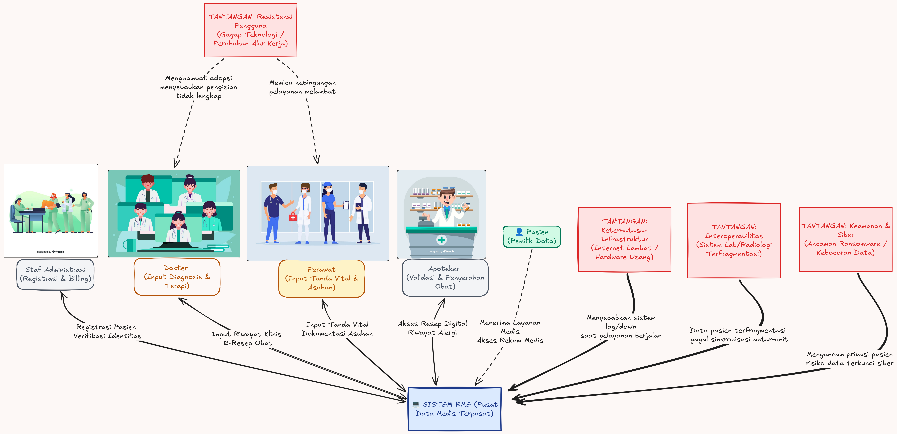

Nama: Fadhil Andriawan

NIM: 053497355

##### 1. Analisis Rich Picture dalam Sistem Kesehatan Digital ##### a) Jelaskan pentingnya Rich Picture dalam memahami sistem informasi yang kompleks. Apa perbedaannya dengan diagram UML biasa?

Rich Picture merupakan tipe diagram yang memiliki ciri khas menggunakan gambaran yang bebas dan dapat dimengerti oleh semua orang. Rich picture digunakan dalam fase pre-analysis sebelum ada di tahap memahami proses atau struktur project.

Bedanya dengan UML biasa adalah, UML digunakan untuk mengakomodir semua case by case secara sangat mendetail. UML digunakan untuk spesfik berdiskusi dengan antar tim pengembang, sedangkan Rich picture tidak. Rich picture juga mengakomodir informasi terkait sesuatu yang melibatkan manusia seperti budaya organisasi, politik intenal dan lain lain yang itdak diakomodir oleh diagram teknis seperti UML.

##### b) Bayangkan Anda sedang mengembangkan sistem rekam medis elektronik di sebuah rumah sakit. Identifikasi 5 tantangan utama yang dapat muncul dalam implementasi sistem ini (misalnya, resistensi pengguna, keamanan data, interoperabilitas, dll.).

Sebuah aplikasi rekam medis memiliki tingkat kompleksitas yang cukup tinggi. Dalam pengembangannya memiliki banyak tantangan utama yang dapat muncul.

1. Resistensi Pengguna

Tantangan ini muncul karena pegawai seperti dokter, perawat dan staf administrasi sudah terbiasa menggunakan kertas bertahun tahun. Saat sistem Rekam Medis diperkenalkan, pegawai cenderung menganggap alur kerja seperti ini mengganggu produktivitas mereka.

Dimulai dari dokter yang harus berfokus ke layar untuk menginput data akan menyita waktu sementara harus tetap berinteraksi dengan pasien langsung. Begitu juga dengan petugas yang lanjut usia mengalami kendala karena kurang keterampilan terkait teknologi.

2. Interoperability

Pada sebuah sitem rumah sakit atau kesehatan, memiliki sistem yang terpisah sebelumnya seperti laboratorium atau radiologi. Dikarenakan kurangnya standar integrasi data dan ketidakcocokan struktur membuat pertukaran data tidak seamless dan sulit dilakukan.

3. Keamanan data dan privasi

Data yang ada pada rekam medis sangat personal dan sensitif. Peralihan ke rekam medis menjadikan data bisa diakses secara digital di jaringan rumah sakit. Reisko ini bisa sangat berbahaya jika sistem perlindungan tidak dienkripsi dengan kuat, kontrol akses yang ketat dan autentikasi belum optimal.

4. Keterbatasan infrastruktur teknologi dan jaringan

Untuk sistem Rekam Medis yang besar, diperlukan ekosistem teknologi yang kokoh. Banyaknya rumah sakit yang masih menggunakan hardware dengan spesifikasi rendah menjadikan ketidakstabilan terhadap sistem dan menjadi kendala teknis utama.

5. Tingginya biaya

Adopsi dari aplikasi Rekam Medis, membutuhkan anggaran di awal untuk fasilitas seperti komputer, server dan jaringan yang cepat hingga ke pelatihan pegawai. Keterbatasan anggaran menjadi tanntangan utama ketika implementasi aplikasi rekam medis.

Kesimpulan

Untuk membangun sistem aplikasi rekam medis diperlukan biaya yang tidak sedikit, mempertimbangkan banyak faktor dari keamanan serta pelatihan untuk pegawai. Akan tetapi memiliki dampak yang sangat baik jika sudah berhasil diimplementasi. Data yang masuk di dalam sistem tidak perlu dicari dengan susah payah ke arsip manual. Semua bisa dicari dengan sistem. Integrasi di seluruh sistem rumah sakit juga berpotensi meringankan pekerjaan pegawai dan pengguna untuk tidak perlu menulis ulang setiap saat.

##### c) Buatlah Rich Picture yang menggambarkan bagaimana sistem rekam medis berinteraksi dengan berbagai pihak (dokter, perawat, pasien, apoteker, bagian administrasi, dll.) serta bagaimana tantangan-tantangan tersebut mempengaruhi sistem.

Dari rich picuter ini, menjelaskan ekosistem yang dipengaruhi oleh perilaku manusia dan kondisi infrastruktur.

1. Inti sistem yang berada di tengah, berfungsi mengumpulkan memproses dan mendistribusikan data rekam medis ke seluruh unit RS.
2. Dokter dan perawat, berada di sisi kiri yang berinteraksi langsung secara dua arah dengan aplikasi untuk memasukkan tanda-tanda vital, hasil diagnosis, dan menentukan tindakan klinis pasien.
3. Staf admin dan apoteker berada di sisi kanan, admin menginput data demografi di awal dan apoteker menarik data rekam medis berupa resep untuk peracikan dan penyerahan obat.
4. Pasien, terhubung dengan sistem utama sebagai objek keseluruhan data rekam medis.

Untuk tantangan digambarkan berwarna merah yaitu:
1. Resistensi  SDM, menandakan adanya hambatan adaptasi, tidak ingin beralih ke digital, atau minim literasi komputer.
2. Interoperabilitas, ancaman dari ketidakcocokan format data ketika aplikasi berinteraksi dengan lab eksternal.
3. Keamanan / serangan siber, memvisualisasikan ancaman kebocoran data sensitif pasien atau serangan ransomware yang bisa mengganggu operasional rumah sakit.

##### 2. Manajemen Proyek Perangkat Lunak - Studi Kasus Sistem Marketplace Digital

##### a) Penentuan kebutuhan proyek: Bagaimana tim dapat memastikan bahwa kebutuhan sistem marketplace telah dikumpulkan dengan baik dan dapat diterapkan dalam pengembangan?

Untuk memastikan kebutuhan sistem telah dikumpulkan dengan baik, diperlukan manajemen aktivitas proyek yang baik. Aktivitas yang bisa dilakukan untuk manajemen aktivitas proyek antara lain:

1. Menulis proposal, penulisan proposal di awal sangat penting untuk pelanggan agar memiliki gambaran secara umum terkait kebutuhan dan dari segi biaya waktu serta kebutuhan marketplace hingga fitur terkait yang utama.
2. Perencanaan dan penjadwalan, hal ini penting untuk dilakukan di awal, karena berkaitan dengan pelaksanaan proyek aplikasi agar berjalan dengan baik.
3. Pengawasan dan peninjauan proyek, dalam implementasi maupun perencanaan diperlukan selalu untuk pengawasan dan peninjauan, untuk memastikan setiap fitur marketplace diimplementasikan dengan baik dan berjalan dengan baik.
4. Validasi kebutuhan dengan prototipe, sering kali pelanggan baru menyadari kebutuhan mereka setelah melihat bentuk visual sistem. Sehingga pembuatan prototipe oleh UI/UX diperlukan untuk uji coba dari sisi pengguna sebelum program dituliskan.

Selain poin poin di atas, diperlukan juga untuk melakukan manajemen resiko. Manajemen resiko dilakukan untuk mengantisipasi dan menganalisa masalah yang mungkin akan terjadi. Sehingga apabila masalah tersebut suatu waktu terjadi, langkah mitigasi bisa dilakukan atau bahkan dicegah agar tidak terjadi.

Sehingga dengan mengkombinasikan manajemen aktivitas hingga manajemen resiko yang matang bisa mengumpulkan dan menyaring kebutuhan yang realistis, aman dari resiko kegagalan dan siap dikerjakan oleh tim pengembang.

##### b) Perencanaan dan risiko proyek: Identifikasi minimal 3 risiko utama dalam pengembangan sistem marketplace dan bagaimana cara mengatasinya

1. Resiko ketidakpastian
Klien atau tim internal dari perusahaan bisa secara terus menerus meminta fitur baru di tengah jalan, hal ini memungkinkan untuk merusak jadwal perilisan hingga pengambangan. Untuk mengatasi hal ini bisa digunakan untuk metode agile dengan story card, dimana setiap permintaan fitur baru di luar proposal awal harus dianalisa terlebih dahulu terkait dampaknya sebelum dieksekusi.
2. Resiko integrasi pihak ketiga
Keterlambatan dari integrasi API sistem pembayaran memiliki kemungkinan untuk tidak stabil atau bahkan menjadi stopper di sistem. Untuk mengatasinya bisa menyediakan opsi cadangan jika vendor utama mengalami gangguan.
3. Resiko rendahnya adopsi pengguna
Ketika aplikasi sudah jadi, ada kemungkinan untuk aplikasi tidak digunakan oleh penjual lokal karena alur aplikasi nya terlalu rumit. Cara mengatasinya adalah dengan memasukkan aktivitas pelatihan UMKM ke timeline proyek dan merancang tampilan sesederhana mungkin dan user-friendly.

##### c) Pembiayaan proyek: Bagaimana strategi yang dapat digunakan startup untuk mendapatkan pendanaan proyek perangkat lunak ini? Berikan minimal 2 metode pembiayaan yang bisa diterapkan.

1. Pendanaan venture capital atau angel investore
Perusahaan startup bisa mencari investor yang tertarik pada bisnis digital dan marketplace. Investor akan memberikan modal sebagai imbalan kepemilikan saham perusahaan. Metode ini cocok dengan perusahaan startup karena memiliki potensi pertumbuhan tinggi dan ekspansi yang cepat.

2. Crowdfunding
Pembiayaan dengan metode ini dilakukan dengan cara mengumpulkan dana dari masyarakat melalui platform online. Cara ini dilakukan dengan mempresentasikan ide marketplace digital ke publik sehingga bisa mendapat dukungan pengembangan dan menjadi tempat promosi awal produk.

##### d) Evaluasi proyek: Bagaimana cara memastikan bahwa pengembangan sistem marketplace ini berjalan sesuai target? Parameter atau metrik apa yang dapat digunakan untuk mengukur keberhasilan proyek?

Untuk memastikan pengembangan sistem marketplace berjalan sesuai target, tim manajemen proyek harus menerapkan pengawasan yang teratur melalui kombinasi metode seperti Daily Standup Meeting dan evaluasi Sprint jika menggunakan metodologi Agile serta mengukur indikator kinerja utama.

1. Memastikan proyek berjalan sesuai target bisa dilakukan dengan cara membagi proyek ke dalam target-target kecil yang jelas (misal: Minggu ke-4 penyelesaian modul registrasi UMKM, Minggu ke-8 integrasi payment gateway).

2. Parameter keberhasilan bisa dilakukan dengan menggunakan metrik jadwal, yaitu mengukur selisih antara waktu perencanaan dan waktu realisasi. Proyek sukses jika selesai tepat waktu sesuai batas tanggal rilis MVP. Selain itu juga dengan metrik kepuasan pengguna ketika UAT, dimana tingkat kelulusan skenario uji coba oleh perwakilan penjual lokal (UMKM) dan pembeli harus mencapai 100% untuk fungsi-fungsi kritikal (seperti upload produk dan transaksi pembayaran).

##### e) Dokumentasi proyek: Setiap tahapan dalam proyek perangkat lunak membutuhkan dokumentasi. Sebutkan dan jelaskan jenis dokumen yang harus dibuat dalam setiap tahapan proyek perangkat lunak ini.

Dokumentasi diperlukan untuk komunikasi antar tim, atau cetak biru maupun arsip ketika sistem perlu ditingkatkan skalanya.

1. Tahap inisiasi
Pada tahap ini dokumen legalitas formal yang menandai dimulainya proyek. Berisi latar belakang pembuatan marketplace produk lokal, penunjukan manajer proyek, tujuan utama, ruang lingkup global, serta estimasi awal biaya dan waktu.

2. Tahap desain sistem
Dokumen teknis yang berisi arsitektur sistem (arsitektur cloud atau server), rancangan basis data (Entity Relationship Diagram - ERD), alur data (Data Flow Diagram atau UML seperti Use Case dan Sequence Diagram), serta desain antarmuka pengguna (UI/UX wireframe).

3. Tahap implementasi
Dokumentasi di dalam kode program (komentar teknis) serta dokumentasi terpisah untuk integrasi dengan pihak ketiga (seperti dokumentasi API untuk integrasi kurir logistik dan payment gateway). Dokumen ini penting agar pengembang baru di masa depan dapat memahami struktur kode dengan cepat.

4. Tahap pengujian
Rencana pengujian dan skenario uji coba mendetail secara otomatis maupun manual. Berisi langkah-langkah pengujian, hasil yang diharapkan, dan hasil aktual dari fitur marketplace seperti "Membeli produk dengan saldo dompet digital kurang".

5. Tahap penutupan
User manual atau buku panduan diperlukan bagi admin cara memverifikasi toko, panduan bagi penjual UMKM cara mengunggah produk, serta panduan bagi pembeli cara bertransaksi.

Sumber referensi:
- Siswati, S., Ernawati, T., & Khairunnisa, M. (2024). Analisis tantangan kesiapan implementasi rekam medis elektronik di Puskesmas Kota Padang. Jurnal Kesehatan Vokasional, 9(1), 1–11. https://doi.org/10.22146/jkesvo.92719
- Widasari, I. V. S., Ikawati, F. R., & Ma’ruf, A. S. (2025). Literature review: Tantangan interoperabilitas rekam medis elektronik di fasilitas kesehatan. Jurnal Manajemen Informasi Kesehatan, 10(2), 238–246.
- Arsyam, H., Sulaiman, L., & Setiawan, S. (2024). Dampak pemanfaatan elektronik rekam medis di fasilitas kesehatan: Pendekatan sistematik literatur review. Bioscientist: Jurnal Ilmiah Biologi, 12(2), 2049–2071. https://doi.org/10.33394/bioscientist.v12i2.12800
- https://www.foundra.ai/funding/marketplace-startup
- https://www.codegengroup.com/2026/05/26/strategi-pendanaan-startup-sukses/
- BMP MSIM4303 Modul 6-9
