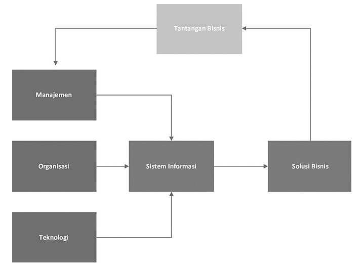

Jelaskan konsep pemilihan teknologi untuk bisnis

--------------------------------------------------------------------------------------------------------------------------------------

Dalam menentukan pemilihan teknologi dari segi bisnis, manajemen akan berusaha menemukan solusi untuk tantangan dalam bisnis, yaitu dengan mengadakan teknologi informasi baru. Pemilihan teknologi memiliki peran penting karena berpengaruh terhadap kualtas produk/jassa, efisiensi proses, dan fleksibilitas bisnis dalam beradaptasi di era digital.

> Laudon & Laudon (2018)

Ilustrasi di atas menjelaskan konsep keterkaitan antara tantangan bisnis, manajemen, organisasi, teknologi, sistem informasi, dan solusi bisnis.

- Tantangan bisnis, merupakan permasalahan yang dihadapi perusahaan.
- Manajemen, Organisasi, Teknologi
  - Manajemen, mengatur pengambilan keputusan dan strategi
  - Organisasi, struktur, proses dan budaya perusahaan yang mendukung implementasi sistem informasi
  - Teknologi, perangkat seperti hardware, software, jaringan yang digunakan untuk mendukung proses bisnis.
- Sistem Informasi, sistem untuk membangun dasar kebutuhan dan tantangan bisnis dengan dukungan dari aspek manajemen, organisasi dan teknologi. Sistem ini menjadi solusi yang mengubah data menjadi inforamsi yang berguna dalam pengambilan keputusan.
- Solusi bisnis, dari sistem informasi yang menghasilkan solusi bisnis, tercipta siklus pemecahan masalah bisnis yang berkesinambungan.

Sehingga dapat disimpulkan bahwa perusahaan harus merespons tantangan bisnis melalui transformasi digital yang berkelanjutan. Pemilihan teknologi yang tepat, didukung oleh aspek manajerial, organisasi, dan teknologi yang selaras, akan menciptakan sistem informasi yang menjadi fondasi utama dalam mencapai keunggulan kompetitif di era modern.