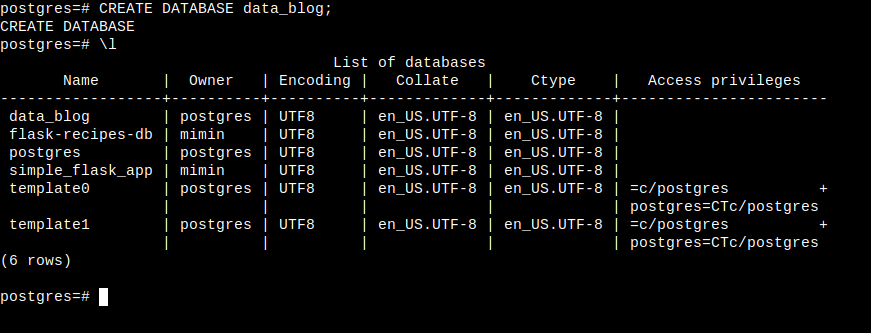

Jelaskan  konsep pengelolaan data dan pengetahuan
------------------

**Pengelolaan data**

Jika pengelolaan data dilakukan secara efektif, maka ini memungkinkan organisasi untuk mendapatkan data dan informasi yang memiliki kualitas baik. Kualitas informasi yang baik meliputi relevan, andal, lengkap, tepat waktu, dapat dipahami, terverifikasi dan dapat diakses.

Komputer mengelola data dimulai dari hierarki:
- Bit seperti 0 dan 1
- Byte, 0100 1001 (huruf dalam standar ASCII)
- Field, seperti kolom nama barang misal Mie Instan
- Record, seperti nama barang, harga, kode barang
- File, kumpulan data dari field dan record
- Basis data, kumpulan dari file file

Dalam mengelola sebuah data, dilakukan dengan sistem manajemen basis data, yaitu aplikasi perangkat lunak khusus untuk mengelola basis data. Dimana jika menggunakan cara tradisional, informasi yang dikembangkan oleh berbagai bagian organisasi akan memiliki aplikasi khusus masing2 dan akan menjadikan tiap aplikasi atau sistem memiliki data sendiri dengan format dan struktur yang berbeda beda. DBMS membantu meminimalkan redundansi, meningkatkan konsistensi data, dan memastikan keamanan serta kontrol akses yang lebih baik.

Sehingga ini akan menyebabkan kurang fleksibilitas dalam penyampaian informasi. Masalah yang dihadapi berikutnya adalah redundansi data, dimana data dalam aplikasi satu ada juga dalam aplikasi lain. Sehingga ketika mengupdate data, harus dilakukan di beberapa aplikasi.

Masalah berikutnya ada pada ketergantungan data dan keamanan. Jika aplikasinya diubah, maka struktur dan format data juga akan berubah. Hal ini memiliki potensi menimbulkan kesalahan pada data. Tiap aplikasi juga harus menjaga keamanan data masing2 agar tidak terjadi kebocoran data maupun kerusakan data.

<figure>Sumber: https://pesonainformatika.com/how-to/belajar-menggunakan-database-postgresql/</figure>

**Pengelolaan pengetahuan**

Data yang sudah disimpan dalam sebuah basis data, harus dianalisis dengan tujuan mendapatkan informasi yang berguna dalam pengambilan keputusan bisnis.

Pengetahuan merupakan atribut dari suatu perusahaan yang berada pada tiap individu maupun secara kolektif. Pengetahuan yang ada di alam benak anggota suatu organisasi merupakan Tacit Knowledge, dokumentasi dari pengetahuan tersebut merupakan Explicit Knowledge.

Manajemen pengetahuan merupakan serangkaian proses bisnis yang dikembangkan dalam suatu organisasi untuk menciptakan, menyimpan, menyemaikan dan menerapkan pengetahuan. Manajemen pengetahuan membantu proses pembelajaran suatu organisasi agar lebih mudah, sistematis dan terstruktur.

Menurut (Laudon & Laudon, 2018), dilakukan beberapa rantai nilai untuk setiap informasi ata data yang diperoleh yaitu:
- Akuisisi pengetahuan, berarti organisasi memperoleh pengetahuan dari manapun dan dengan cara apapun seperti rangkaian dokumen, laporan, presentasi, dan lain-lain.
- Penyimpanan pengetahuan, berarti ketika pengetahuan baru didapatkan dari akuisisi, maka pengetahuan tersebut disimpan agar dapat diakses oleh orang lain, seperti menggunakan basis data yang bisa diakses dengan menggunakan CMS (Content Management System).
- Penyemaian pengetahuan, ketika pengetahuan sudah didapatkan dan disimpan, kemudian data ini diakses dan dipelajari oleh anggota organisasi yang lain.
- Penerapan pengetahuan, ketika sudah dipelajari maka pengetahuan tersebut diaplikasikan.

Dalam melakukan manajemen pengetahuan, terdapat beberapa alat untuk melakukan hal tersebut, yaitu Enterprise Content Management, atau Learning Management System.

Pada karyawan yang melakukan pekerjaan utama menciptakan pengetahuan dan informasi bagi perusahaan terdapat beberapa alat untuk menyesuaikan profesinya, seperti CAD untuk membuat rancangan produk dan manipulasi secara grafis. Kemudian ada 3D printer untuk mencetak benda 3 dimensi, Virtual Reality untuk simulasi ruang dan barang menyerupai kondisi sesungguhnya. Augmented Reality, dimana menggabungkan visual pada lingkungan dengan visualisasi perangkat.

**Kesimpulan**
Pengelolaan data berfokus pada pengaturan data terstruktur secara teknis agar mudah diakses dan akurat. Sementara pengelolaan pengetahuan berfokus pada bagaimana informasi diolah oleh manusia untuk menciptakan nilai, pembelajaran, dan inovasi organisasi.

Sumber referensi:
- BMP MSIM4207 modul 6