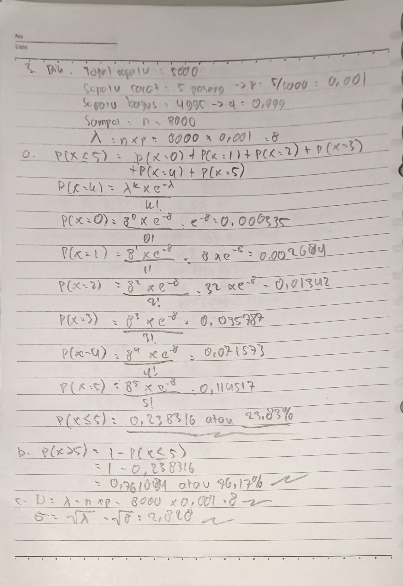

##### Nama: Fadhil Andriawan   NIM: 053497355   Prodi: Sistem Informasi   UPBJJ Jakarta

1. Jelaskan perbedaan antara Distribusi Peluang Diskret dan Kontinu? Jelaskan dan berikan contoh!

    **Distribusi peluang diskrit** yaitu setiap nilai dikaitkan dengan peluang tertentu di suatu rentang, sedangkan **distribusi peluang kontinu** yaitu variabel acak yang dapat mengambil nilai apapun dalam rentang tertentu.

    Contoh:
    - Distribusi peluang diskrit: peluang melempar dadu 6 sisi (1,2,3,4,5,6)
    - Distribusi peluang kontinu: waktu tunggu pelanggan di bank, bisa 5,3 menit, 6 menit, dll

2. Tentukan distribusi peluang bagi jumlah bilangan bila sepasang dadu dilempar. Apakah
termasuk distribusi peluang diskret atau kontinu? Jelaskan jawaban Anda!

    | Jumlah (x) | Cara | Peluang (P(X = x)) |
    | ---------- | ---- | ------------------ |
    | 2          | 1    | 1/36               |
    | 3          | 2    | 2/36               |
    | 4          | 3    | 3/36               |
    | 5          | 4    | 4/36               |
    | 6          | 5    | 5/36               |
    | 7          | 6    | 6/36               |
    | 8          | 5    | 5/36               |
    | 9          | 4    | 4/36               |
    | 10         | 3    | 3/36               |
    | 11         | 2    | 2/36               |
    | 12         | 1    | 1/36               |

    Sehingga peluang jumlah sepasang dadu dilempar adalah peluang diskrit, karena jumlahnya terbatas dengan peluang di kombinasi dua dadu.

3. Seorang pengusaha sepatu memproduksi 5.000 pasang sepatu dan ternyata 5 pasang sepatu
di antaranya tidak memenuhi standard mutu. Pengusaha itu mendapat pesanan sebanyak
8.000 pasang sepatu dari Mr.X yang akan menjualnya kembali. Tentukan peluang:
(a) Mr. X mendapat paling banyak 5 pasang sepatu yang tidak memenuhi standard mutu?
(b) Mr. X mendapat lebih dari 5 pasang sepatu yang tidak memenuhi standard mutu?
(c) Berapa rata-rata dan simpangan baku dari sepatu yang tidak memenuhi standard mutu
yang diperoleh Mr. X?

    

1. Dalam soal Ujian Kompetensi Dasar terdiri atas 300 pertanyaan pilihan ganda. Masingmasing pertanyaan terdapat 4 kemungkinan jawaban. Namun, hanya ada satu jawaban
yang benar. Bila seseorang menjawab secara acak 120 di antara 300 soal yang sama sekali
tidak diketahuinya. Tentukan berapa peluang mendapatkan dari 70 sampai 90 jawaban
yang benar? Tuliskan langkah-langkah pengerjaan soal dengan baik dan jelas.

   #####

   Diketahui:
   - n = 120
   - p = 0,25 (1 dari 4 jawaban benar)
   - q = 0,75

   Dicari: $ 70 <= X <= 90 $
   ####
   Maka dengan menggunakan pendekatan normal:
   mean = $ \mu = n * p = 120 * 0,25 = 30 $
   sigma = $ \sigma = \sqrt(120*0,25*0,75) = \sqrt(22,5) = 4,74 $
   #####

   Maka dengan menggunakan distribusi peluang kontinu
   Untuk Z 69,5 dan 90,5:
   $Z_1 = (69,5-30)/4,74 = 8,33$
   $Z_2 = (90,5-30)/4,74 = 12,80$
   Karena dua nilai Z jatuh di kanan kurva normal standar, maka
   $ P(70 <= X <= 90) \approx P(8,33 <= Z <= 12,80 \approx 0) $

   Berarti peluang seseorang mendapat 70-90 jawaban benar jika menebak acak sangat kecil yaitu mendekati 0.

Sumber referensi:
- BMP SATS412 modul 5-6