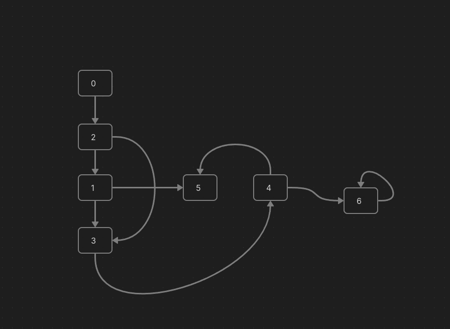
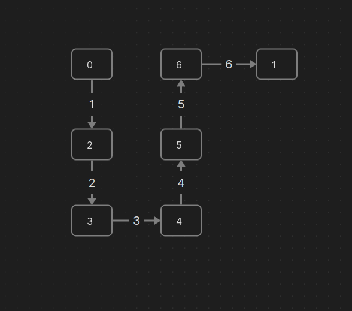
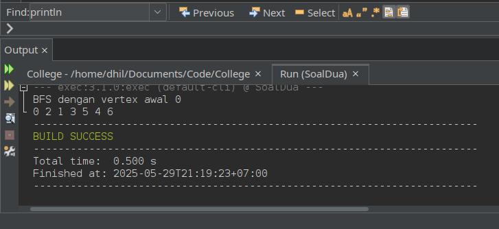
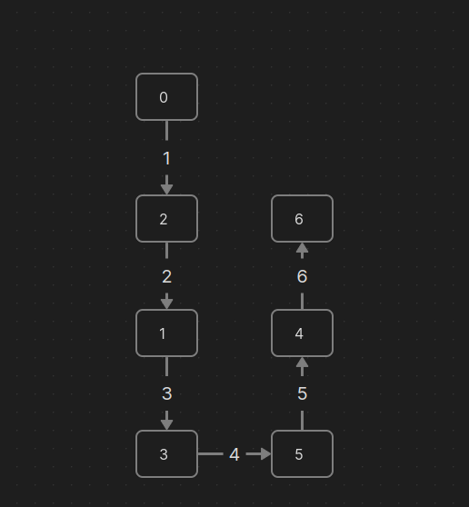

##### Nama: Fadhil Andriawan <br/> NIM: 053497355 <br> Prodi: Sistem Informasi <br> UPBJJ Jakarta

#### Langkah - langkah praktikum

1. Membuka Netbeans dan membuat project baru
   
2. Menulis code
   
3. Menjalankan code
   
   

#### Soal Nomor 1
> 1. Buatlah program pencarian menggunakan algoritma Depth-First Search (DFS) dalam bahasa Java.
> Gunakan graf dengan 7 node yang mewakili a1, a2, a3, a4, a5, a6, a7 (tentukan sendiri nilai hubungan antar node).
> Lakukan pencarian angka n pada graf tersebut dengan DFS.
> Jelaskan tahap demi tahap proses pencarian dan gambarkan dengan rinci prosesnya.

Code:
```java
    /*
    * Click nbfs://nbhost/SystemFileSystem/Templates/Licenses/license-default.txt to change this license
    */

    package com.mycompany.soalsatu;

    import java.io.*;
    import java.util.*;

    /**
    *
    * @author dhil
    */
    public class Graph {
        private int V;
        private LinkedList<Integer> adj[];
        
        Graph(int v){
            V = v;
            adj = new LinkedList[v];
            
            for (int i = 0; i < v; ++i) 
                adj[i] = new LinkedList();
        }
        
        void addEdge(int v, int w){
            adj[v].add(w);
        }
        
        void DFSUtil(int v, boolean visited[]){
            visited[v] = true;
            System.out.print(v+" ");
            Iterator<Integer> i = adj[v].listIterator();
            
            while(i.hasNext()){
                int n = i.next();
                if(!visited[n]) 
                    DFSUtil(n, visited);
            }
        }
        
        void DFS(int v){
            boolean[] visited = new boolean[V];
            DFSUtil(v, visited);
        }
        
        public static void main(String[] args) {
            Graph g = new Graph(7);
            
            int a1 = 0;
            int a2 = 1;
            int a3 = 2;
            int a4 = 3;
            int a5 = 4;
            int a6 = 5;
            int a7 = 6;
                    
            g.addEdge(a1, a3);
            g.addEdge(a1, a2);
            g.addEdge(a1, a4);
            g.addEdge(a2, a6);
            g.addEdge(a3, a4);
            g.addEdge(a4, a5);
            g.addEdge(a5, a6);
            g.addEdge(a5, a7);
            g.addEdge(a7, a7);
            
            System.out.println("DFS"+"(vertex awal 0)");
            g.DFS(0);
        }
    }
```

Hasil Codingan:


Ilustrasi DFS:

Pada baris 52 terdapat proses pemanggilan graph yang memiliki 7 vertex `new Graph(7)`. Kemudian pemanggilan method `g.addEdge` di baris 58 - 66 sehingga terbentuklah graph berikut.



Selanjutnya diubah graph sesuai dengan baris 69 yaitu `g.DFS(0)` dimana vertex 0 menjadi awal vertex untuk melakukan traversal DFS. Kunjungan DFS dimulai ke vertex 0 ke vertex 2, menuju vertex 3, menuju vertex 4, menuju vertex 5, menuju vertex 6, kemudian kembali ke vertex 1.




#### Soal Nomor 2
> 2. Buatlah program pencarian menggunakan algoritma Breadth-First Search (BFS) dalam bahasa Java.
> Gunakan graf dengan 7 node yang mewakili a1, a2, a3, a4, a5, a6, a7 (tentukan sendiri nilai hubungan antar node).
> Lakukan pencarian angka n pada graf tersebut dengan BFS.
> Jelaskan tahap demi tahap proses pencarian dan gambarkan dengan rinci prosesnya.

Code:
```java
    /*
 * Click nbfs://nbhost/SystemFileSystem/Templates/Licenses/license-default.txt to change this license
 */
package com.mycompany.soaldua;

import java.io.*;
import java.util.*;

/**
 *
 * @author dhil
 */
public class Graph {
    private int V;
    private LinkedList<Integer> adj[];
    
    Graph(int v){
        V = v;
        adj = new LinkedList[v];
        
        for (int i = 0; i < v; ++i) 
            adj[i] = new LinkedList();
    }
    
    void addEdge(int v, int w){
        adj[v].add(w);
    }
    
    void BFS(int s){
        boolean[] visited = new boolean[V];
        LinkedList<Integer> queue = new LinkedList<Integer>();
        visited[s] = true;
        queue.add(s);
        
        while(queue.size() != 0){
            s = queue.poll();
            System.out.print(s+" ");
            Iterator<Integer> i = adj[s].listIterator();
            
            while(i.hasNext()){
                int n = i.next();
                if(!visited[n]){
                    visited[n] = true;
                    queue.add(n);
                }
            }
        }
    }

    public static void main(String[] args) {
        Graph g = new Graph(7);
        
        int a1 = 0;
        int a2 = 1;
        int a3 = 2;
        int a4 = 3;
        int a5 = 4;
        int a6 = 5;
        int a7 = 6;
                
        g.addEdge(a1, a3);
        g.addEdge(a1, a2);
        g.addEdge(a1, a4);
        g.addEdge(a2, a6);
        g.addEdge(a3, a4);
        g.addEdge(a4, a5);
        g.addEdge(a5, a6);
        g.addEdge(a5, a7);
        g.addEdge(a7, a7);
        
        System.out.println("BFS dengan vertex awal 0");
        g.BFS(0);
    }
}
```

Hasil Codingan:


Ilustrasi DFS:

Pada baris 52 terdapat proses pemanggilan graph yang memiliki 7 vertex `new Graph(7)`. Kemudian pemanggilan method `g.addEdge` di baris 54 - 70 sehingga terbentuklah graph berikut.


Selanjutnya diubah graph sesuai dengan baris 73 yaitu `g.DFS(0)` dimana vertex 0 menjadi awal vertex untuk melakukan traversal DFS. Kunjungan DFS dimulai ke vertex 0 ke vertex 2, menuju vertex 1, menuju vertex 3, menuju vertex 5, menuju vertex 4, kemudian ke vertex 6.



#### Link Video
https://youtu.be/X_Qu5y1VXg8

#### Bukti Pengerjaan


#### Source Code
https://github.com/Fadhil-Sabar/college/tree/25875fe09161f6e6452657dda18fb03cb1e97a75/struktur-data/TugasTiga

#### Sumber Referensi
- BMP MSIM4202 Modul 9